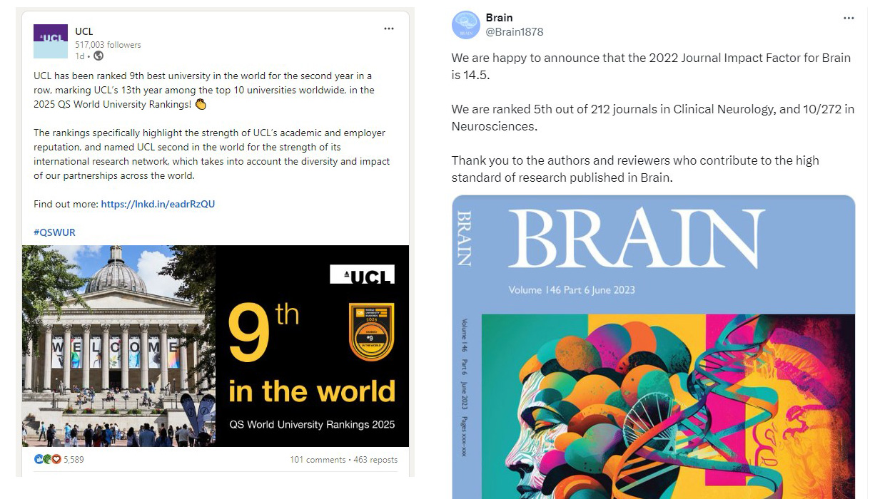

```{r setup, include=FALSE}
# see https://github.com/rstudio-education/arm-workshop-rsc2019/blob/master/static/slides/xaringan.Rmd
knitr::opts_chunk$set(echo = FALSE, warning=FALSE, message=FALSE, error=FALSE, comment='', dpi=400, fig.align='center')
options(htmltools.dir.version = FALSE)
#xaringanExtra::use_xaringan_extra(c("tile_view", "animate_css", "tachyons"))
library(tidyverse)
library(dplyr)
library(flextable)
library(ggplot2)
library(knitr)
library(fontawesome) # from github: https://github.com/rstudio/fontawesome
cbbPalette <- c("#000000", "#E69F00", "#56B4E9", "#009E73", "#F0E442", "#0072B2", "#D55E00", "#CC79A7")
```

layout: true
  
---
name: xaringan-title
class: inverse, left, middle

.pull-left[

# .center[CSH600: Evidence-Based Clinical Practice: Bad science]

## .center[Adrian Barnett, QUT]

### .center[June 2024]

[`r fa(name = "mastodon")` @aidybarnett](https://fediscience.org/@aidybarnett)  

[`r fa(name = "github")` @agbarnett](http://github.com/agbarnett)  

[`r fa(name = "blog")` Median Watch](https://medianwatch.netlify.app)

[`r fa(name = "paper-plane")` a.barnett@qut.edu.au](mailto:a.barnett@qut.edu.au)

]

.pull-right[


##### (from Netflix on giphy)

]

<!--- Aim for ? minutes --->

---
background-image: url(figures/AcknowledgementTraditionalOwners.jpg)
background-size: cover

---
.left-column[
# How science should work
]

.right-column[

```{r, out.width='55%'}
knitr::include_graphics(path='figures/scientific-method.jpg')
```

##### Helmenstine, Anne Marie, Ph.D. "Scientific Method Flow Chart." [ThoughtCo](https://www.thoughtco.com/scientific-method-flow-chart-609104), Apr. 5, 2023.

]

---
.left-column[
# How some science actually works
]

.right-column[

```{r, out.width='105%'}
knitr::include_graphics(path='figures/Paper_Mills.jpg')
```

##### From Tricky Goose Training [https://www.trickygoose.training/downloads](https://www.trickygoose.training/downloads)

]

---
## Tortured phrases

```{r, out.width='65%'}
knitr::include_graphics(path='figures/figures/tortured_phrases.jpg')
```

##### From [Nature](https://www.nature.com/articles/d41586-021-02134-0) based on work by [Guillaume Cabanac and colleagues](https://arxiv.org/abs/2107.06751)

---
## What about peer review?

---
## Why does this happen?



<!--- from https://www.linkedin.com/posts/university-college-london_qswur-activity-7203848706847092736-xV3o?utm_source=share&utm_medium=member_desktop and https://twitter.com/Brain1878/status/1674404395335794689 --->


---
class: inverse
# Bad scientific practice is nothing new

<!--- % https://www.bbc.co.uk/sounds/play/b00pfkw3 "Scientists competed to find the tallest species. Why not add a few extra neck bones?" --->

.pull-left[

```{r, out.width='50%'}
knitr::include_graphics(path='https://upload.wikimedia.org/wikipedia/commons/a/af/Dinornis_maximus%2C_Natural_History_Museum_%28PV_A_608%29.jpg')
```

###### Natural History Museum, London, CC BY 4.0 <https://creativecommons.org/licenses/by/4.0>, via Wikimedia Commons

]

.pull-right[


###### Conty, CC BY 3.0 <https://creativecommons.org/licenses/by/3.0>, via Wikimedia Commons

]

---
## Effects of competition

```{r, out.width='72%'}
knitr::include_graphics(path='figures/Z_plot_slide.png')
```

##### DOI: [10.1111/stan.12241](https://doi.org/10.1111/stan.12241)

---

.left-column[
# Harms of missing evidence 
]

.right-column[
```{r, out.width='88%'}
knitr::include_graphics(path='figures/bbc_news.jpg')
```
]

---
## Deluge of papers

```{r, out.width='68%'}
knitr::include_graphics(path='figures/papers_increasing.jpg')
```

##### DOI: [10.48550/arXiv.2309.15884](https://doi.org/10.48550/arXiv.2309.15884)

---
# 85% waste

---
## Pandemic, prediction models...


---
## Bad science

Dangers to talking about bad science. 

Exploited by groups with a vested interesting, e.g., climate deniers
