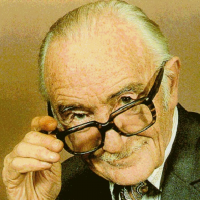

```{r setup, include=FALSE}
# see https://github.com/rstudio-education/arm-workshop-rsc2019/blob/master/static/slides/xaringan.Rmd
knitr::opts_chunk$set(echo = FALSE, warning=FALSE, message=FALSE, error=FALSE, comment='', dpi=400, fig.align='center')
options(htmltools.dir.version = FALSE)
#xaringanExtra::use_xaringan_extra(c("tile_view", "animate_css", "tachyons"))
library(tidyverse)
library(dplyr)
library(flextable)
library(ggplot2)
library(knitr)
library(fontawesome) # from github: https://github.com/rstudio/fontawesome
cbbPalette <- c("#000000", "#E69F00", "#56B4E9", "#009E73", "#F0E442", "#0072B2", "#D55E00", "#CC79A7")
```

layout: true
  
---
name: xaringan-title
class: inverse, left, middle

.pull-left[

# .center[CSH600: Evidence-Based Clinical Practice: Bad science]

## .center[Adrian Barnett, QUT]

### .center[July 2024]

[`r fa(name = "mastodon")` @aidybarnett](https://fediscience.org/@aidybarnett)  

[`r fa(name = "github")` @agbarnett](http://github.com/agbarnett)  

[`r fa(name = "blog")` Median Watch](https://medianwatch.netlify.app)

[`r fa(name = "paper-plane")` a.barnett@qut.edu.au](mailto:a.barnett@qut.edu.au)

]

.pull-right[


##### (from Netflix on giphy)

]

<!--- Aim for ? minutes --->

---
background-image: url(figures/AcknowledgementTraditionalOwners.jpg)
background-size: cover

---
class: inverse
# When science gets competitive

<!--- % https://www.bbc.co.uk/sounds/play/b00pfkw3 "Scientists competed to find the tallest species. Why not add a few extra neck bones?" --->

.pull-left[

```{r, out.width='50%'}
knitr::include_graphics(path='https://upload.wikimedia.org/wikipedia/commons/a/af/Dinornis_maximus%2C_Natural_History_Museum_%28PV_A_608%29.jpg')
```

###### Natural History Museum, London, CC BY 4.0 <https://creativecommons.org/licenses/by/4.0>, via Wikimedia Commons

]

.pull-right[


###### Conty, CC BY 3.0 <https://creativecommons.org/licenses/by/3.0>, via Wikimedia Commons

]

---
.left-column[
# How science should work
]

.right-column[

```{r, out.width='55%'}
knitr::include_graphics(path='figures/scientific-method.jpg')
```

##### Helmenstine, Anne Marie, Ph.D. "Scientific Method Flow Chart." [ThoughtCo](https://www.thoughtco.com/scientific-method-flow-chart-609104), Apr. 5, 2023.

]

---
### Evidence based practice

```{r, out.width='64%'}
knitr::include_graphics(path='figures/IoM.jpg')
```

Source: [Institute of Medicine](https://pubmed.ncbi.nlm.nih.gov/24983062/) "Finding What Works in Health Care"


---
.left-column[

## Journal publications are a key source of evidence

## Abstract from the RECOVERY trial

###### DOI: [10.1056/NEJMoa2021436](https://www.nejm.org/doi/full/10.1056/NEJMoa2021436)

]

.right-column[

```{r, out.width='61%'}
knitr::include_graphics(path='figures/recovery_trial.jpg')
```

]

---

.left-column[

## "Negative" findings are important

## Abstract from the ORBITA trial

###### DOI: [10.1016/S0140-6736(17)32714-9](https://pubmed.ncbi.nlm.nih.gov/29103656/)

]

.right-column[

```{r, out.width='87%'}
knitr::include_graphics(path='figures/orbita_trial.jpg')
```

]

---
class: center, middle

```{r, out.width='82%'}
knitr::include_graphics(path='figures/pubmed.jpg')
```

---
## Drowning in evidence: publication numbers over time

```{r, out.width='68%'}
knitr::include_graphics(path='figures/papers_increasing.jpg')
```

##### DOI: [10.48550/arXiv.2309.15884](https://doi.org/10.48550/arXiv.2309.15884)

---
## Missing evidence for antidepressants


```{r, out.width='55%'}
knitr::include_graphics(path='figures/bias_diagram.jpeg')
```

##### DOI: [10.1017/S0033291718001873](https://doi.org/10.1017/S0033291718001873)

---
class: inverse
## "Significant" findings and the p-value

### "Significance'' has a special meaning in health and medicine; most often means statistical significance

### "Significance'' is judged by the p-value

### Arbitrary p-value threshold of 0.05 to sift results into significant or not, which is often misrepresented as important or not

--

### RECOVERY trial results for Dexamethasone were highly significant P $<$ 0.001, strongly suggesting a real benefit from Dexamethasone 

### ORBITA trial results for stents were not significant P = 0.2, which could mean that stents have no value in that patient-group


---
## Effects of competition on current evidence

```{r, out.width='72%'}
knitr::include_graphics(path='figures/Z_plot_slide.png')
```

##### DOI: [10.1111/stan.12241](https://doi.org/10.1111/stan.12241)

---
class: inverse
# Goodhart's law

.pull-left[

## "When a measure becomes a target, it ceases to be a good measure."

]

.pull-right[

```{r, out.width='60%'}
knitr::include_graphics(path='figures/Charles_Goodhart_delives_the_2012_Long_Finance_conference_keynote_speech.jpg')
```

##### Jamesfranklingresham, CC BY-SA 3.0 <https://creativecommons.org/licenses/by-sa/3.0>, via Wikimedia Commons

]

---

.left-column[
# Noticeable harms of missing evidence 
]

.right-column[
```{r, out.width='88%'}
knitr::include_graphics(path='figures/bbc_news.jpg')
```
]


---
## Removing outliers

```{r, out.width='55%'}
knitr::include_graphics(path='figures/Weiner-1.png')
```

### “It was a quest for aesthetics, for beauty — instead of the truth”, Diederik Stapel

--

### "The most exciting phrase to hear in science, the one that heralds new discoveries, is not “Eureka” but “That’s funny...”", Isaac Asimov

---
.left-column[
## Very worst kind of evidence production
]

.right-column[

```{r, out.width='115%'}
knitr::include_graphics(path='figures/Paper_Mills.jpg')
```

##### From Tricky Goose Training [https://www.trickygoose.training/downloads](https://www.trickygoose.training/downloads)

]

---
## Tortured phrases

```{r, out.width='60%'}
knitr::include_graphics(path='figures/tortured_phrases.jpg')
```

##### From [Nature](https://www.nature.com/articles/d41586-021-02134-0) based on work by [Guillaume Cabanac and colleagues](https://arxiv.org/abs/2107.06751)

---
## What about peer review?

.pull-left[

* #### Cannot always spot errors

* #### Done by volunteers

* #### Rarely valued by your employer  

* #### Rejected papers just move elsewhere

]

.pull-right[


##### from The Simpsons on giphy

]

---
## Chasing metrics

```{r, out.width='75%'}
knitr::include_graphics(path='figures/crowing.jpg')
```


##### From [LinkedIn](https://www.linkedin.com/posts/university-college-london_qswur-activity-7203848706847092736-xV3o?utm_source=share&utm_medium=member_desktop) and [X](https://twitter.com/Brain1878/status/1674404395335794689)


---
class: center, middle, inverse
# Techniques for generating better evidence

---
class: inverse
## Archie Cochrane's bias removal trick

.pull-left[



##### Photo from Cardiff University Library, Cochrane Archive, University Hospital Llandough

##### Story from: Cochrane, A. L. (2009) One Man's Medicine: An Autobiography of Professor Archie Cochrane. Cardiff: Cardiff University.

]

.pull-right[

```{r, out.width='55%'}
knitr::include_graphics(path='figures/ante-samarzija-F7m3QZJ_4mg-unsplash.jpg')
```

##### Photo by <a href="https://unsplash.com/@antesamarzija?utm_content=creditCopyText&utm_medium=referral&utm_source=unsplash">Ante Samarzija</a> on <a href="https://unsplash.com/photos/white-hospital-bed-in-a-room-F7m3QZJ_4mg?utm_content=creditCopyText&utm_medium=referral&utm_source=unsplash">Unsplash</a>
  
]

---
## Registered reports

```{r, out.width='55%'}
knitr::include_graphics(path='figures/pbio.3000246.g001.png')
```

DOI: [10.1371/journal.pbio.3000246.g001](https://journals.plos.org/plosbiology/article/figure?id=10.1371/journal.pbio.3000246.g001)

---
## Slow down

.pull-left[
### "We need less research, better research, and research done for the right reasons" [The scandal of poor medical research](https://www.bmj.com/content/308/6924/283) 1994
]

.pull-right[

```{r, out.width= '40%'}
knitr::include_graphics("https://upload.wikimedia.org/wikipedia/commons/1/12/Doug_altman.jpeg")
```

##### Doug Altman, Photo: Oxford Clinical Trials Research Unit

]

---
class: center, middle

```{r, out.width='69%'}
knitr::include_graphics(path='figures/c4r.jpg')
```


---
# [James Lind Alliance](https://www.jla.nihr.ac.uk/top-10-priorities/)

```{r, out.width='64%'}
knitr::include_graphics(path='figures/james_lind.png')
```

---
class:inverse

```{r, out.width='55%'}
knitr::include_graphics(path='figures/bik.jpg')
```

##### From [Nature](https://www.nature.com/articles/d41586-020-01363-z)

---
## Bad science

.left-column[


##### From giphy

]

.right-column[

* #### Dangers of talking about bad science. 

* #### Exploited by groups with a vested interesting, e.g., climate deniers

]

---
class:center, middle
```{r, out.width='65%'}
knitr::include_graphics(path='figures/misconduct_montage.jpg')
```

(from [ABC news](https://www.abc.net.au/news/2014-12-12/university-of-queensland-professor-on-fraud-charges/5964476); [RetractionWatch](https://retractionwatch.com/2023/10/02/nobel-prize-winner-gregg-semenza-tallies-tenth-retraction/); [NPR news](https://www.npr.org/2023/07/19/1188828810/stanford-university-president-resigns); [The Guardian](https://www.theguardian.com/education/2023/jun/25/harvard-professor-data-fraud))

---
# Summary

* ### Science is the best thing that has happened to humanity

* ### We can do it better

* ### Carefully assess what evidence you read, search for potentially missing evidence
