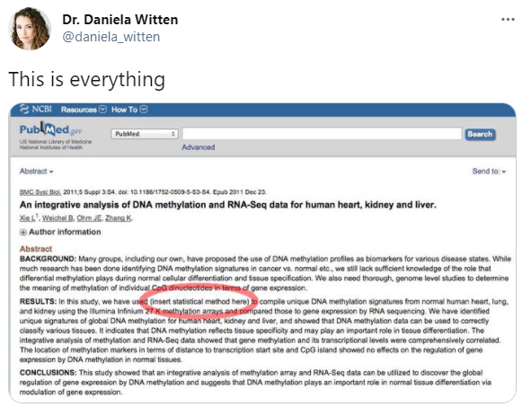
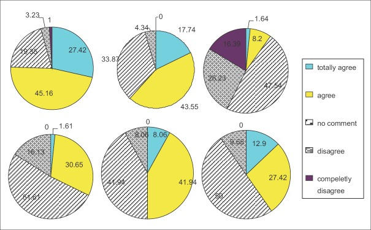
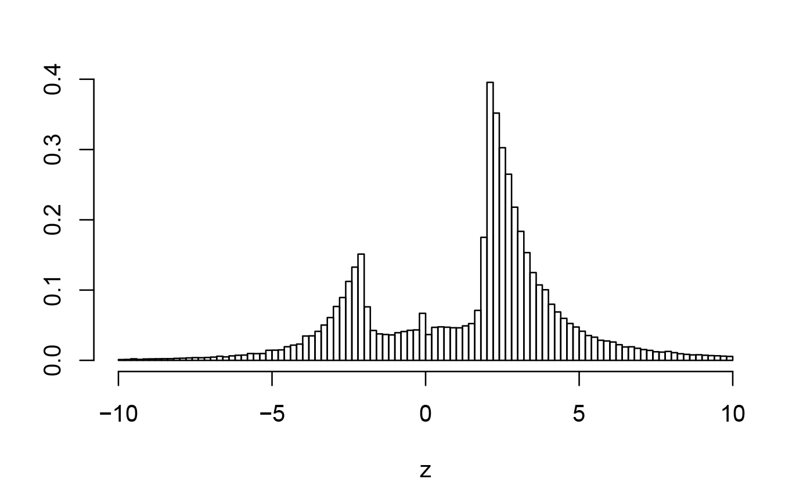
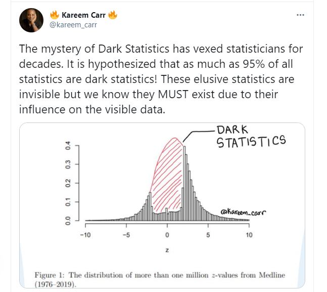
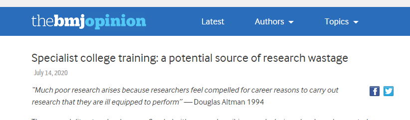
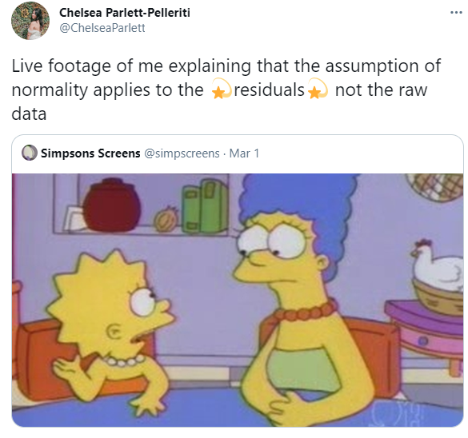
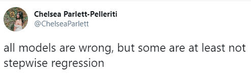
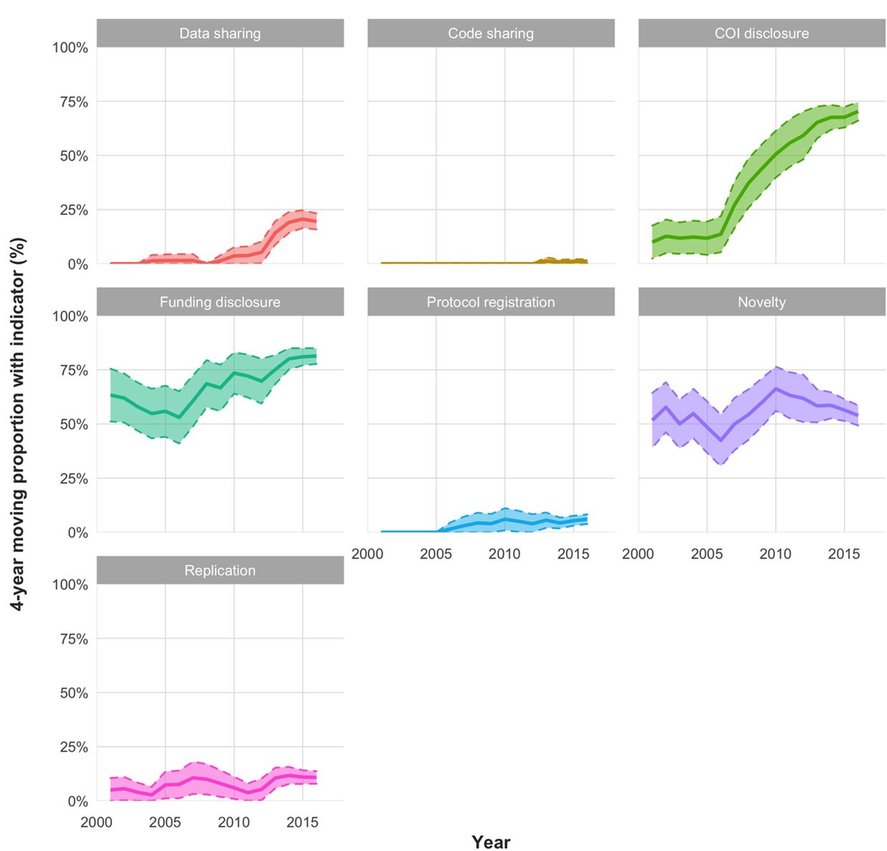
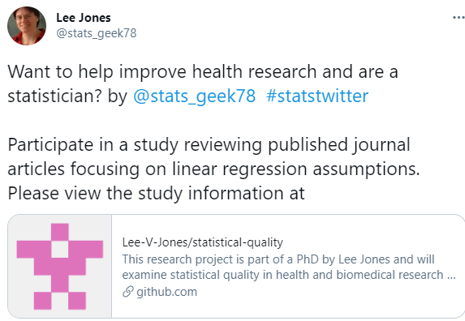

```{r setup, include=FALSE}
# see https://github.com/rstudio-education/arm-workshop-rsc2019/blob/master/static/slides/xaringan.Rmd
knitr::opts_chunk$set(echo = FALSE, warning=FALSE, message=FALSE, error=FALSE, comment='', dpi=400, fig.align='center')
options(htmltools.dir.version = FALSE)
#xaringanExtra::use_xaringan_extra(c("tile_view", "animate_css", "tachyons"))
library(tidyverse)
library(dplyr)
library(ggplot2)
library(knitr)
library(fontawesome) # from github: https://github.com/rstudio/fontawesome
cbbPalette <- c("#000000", "#E69F00", "#56B4E9", "#009E73", "#F0E442", "#0072B2", "#D55E00", "#CC79A7")
```

layout: true
  
---
name: xaringan-title
class: inverse, left, middle

# .center[Bad statistics in health and medical research]

## .center[Lancaster Lecture]

### .center[Adrian Barnett, Queensland University of Technology]

#### .center[24 March 2021]

[`r fa(name = "twitter")` @aidybarnett](http://twitter.com/aidybarnett)  

[`r fa(name = "github")` @agbarnett](http://github.com/agbarnett)  

[`r fa(name = "blog")` Median Watch](https://medianwatch.netlify.app)

[`r fa(name = "paper-plane")` a.barnett@qut.edu.au](mailto:a.barnett@qut.edu.au)


---
background-image: url(figures/AcknowledgementTraditionalOwners.jpg)
background-size: cover

---

## Henry Oliver Lancaster, 1913 to 2001

.pull-left[


]

.pull-right[

#### Co-founded the Statistical Society of Australia.

#### HRH: "Lies, damn lies and statistics''

#### HOL: "Figures fool when fools figure"

]

<!--- https://stackoverflow.com/questions/46408057/incremental-slides-do-not-work-with-a-two-column-layout --->


---
## This talk in a nutshell


---
## Boom in quantity

```{r, out.width= '50%'}
library(rentrez)
is.data = length(dir('data', pattern='pubmed'))>0 # already data
if(is.data==FALSE){
counts = NULL
for (year in 1990:2020){
  search_text = paste(year, '[PDAT]', sep='')
  psearch = entrez_search(db='pubmed', term=search_text)
  frame = data.frame(year = year, count=psearch$count)
  counts = bind_rows(counts, frame)
}
save(counts, file='data/pubmed.RData')
}
if(is.data==TRUE){
  load('data/pubmed.RData')
}
counts = mutate(counts, scale = count / 10^5)
plot = ggplot(data=counts, aes(x=year, y=scale))+
  geom_line(size=1.9, color='indianred1')+
  xlab('Year')+
  ylab('Number of items (per 100,000)')+
  theme_bw()+
  theme(text = element_text(size=22),
        panel.grid.minor = element_blank())
plot
```

Data from _PubMed_.

---
## Reverse boom in quality

```{r, out.width= '50%'}
arrow = data.frame(x=1990, xend=2020, y=16, yend=4)
text = data.frame(x=2005, y=11, label='Quality?')
new_plot = plot + 
  geom_segment(data=arrow, aes(x=x, y=y, xend=xend, yend=yend), size=2, colour='darkseagreen3', arrow=arrow())+
  geom_text(data=text, aes(x=x, y=y, label=label), colour='darkseagreen3', size=11, angle=-42)
new_plot
```

---
class:inverse, center
## Research-shaped objects

```{r, out.width= '100%'}
knitr::include_graphics("https://raw.githubusercontent.com/agbarnett/talks/master/AIMOS/figures/cakes.jpg")
```

---
### Bad statistics is abetting weak science

<!--- from ANZCTR: --->

* "Two-tailed T tests will be performed with a p value of 0.05 indicating significance."

* "All statistical analysis was performed using the Graphpad Prism software.”

 

--

* "Many people think that all you need to do statistics is a computer and appropriate software." Doug Altman

###### [Stark and Saltelli](https://rss.onlinelibrary.wiley.com/doi/full/10.1111/j.1740-9713.2018.01174.x) "Cargo‐cult statistics and scientific crisis" _Significance_ 2018

---
class: top, center, inverse
background-image: url(figures/podium.jpg)
background-size: cover
### .left[Worst ever statistical methods section]

--

## .left[t-test]

--

## .right[SPSS]


<!--- http://www.anzctr.org.au/Trial/Registration/TrialReview.aspx?ACTRN=12617001415392 --->

--

## .center[SSPS]

<!--- https://www.anzctr.org.au/Trial/Registration/TrialReview.aspx?id=373697 --->


---
class: top, center, inverse
# Platinum medal

```{r, out.width= '61%'}

```


---
# Terrible practice

### Regression:

<!--- ---> 
* [Only 22% of papers in medical journals reported checks of the regression model assumptions](https://ebm.bmj.com/content/24/5/185)

<!--- https://peerj.com/articles/3323/ --->
* [92% of all papers using linear regression were unclear about their assumption checks](https://peerj.com/articles/3323/)

### Sample size:

<!--- --->
* [Studies that explained sample size: 0%, 6% and 17%](https://www.thelancet.com/action/showPdf?pii=S0140-6736%2813%2962228-X)

### Figures:

<!--- Schriger, D. L. et al. From submission to publication: A retrospective review of the tables and figures in a cohort of randomized controlled trials submitted to the british medical journal --->
* "[Less than half the figures met their data presentation potential](https://pubmed.ncbi.nlm.nih.gov/16978740/)"


---
class:inverse
### Terrible plots

```{r, echo=FALSE, out.width="60%"}

```

<!--- from https://www.ncbi.nlm.nih.gov/pmc/articles/PMC4946282/ --->

.pull-left[

<!--- top left 1 + 3.23 + 19.35 + 27.42 + 45.16 =  96.16, top-middle 17.74+43.55+33.87+4.34 = 99.5, bottom-right = 1.61+30.65+16.13+51.61 =100 :--->

* No labels

* Terrible colours and moiré patterns

* Unexplained changes in size

]

.pull-right[


* Numbers don't add to 100 (top-left is 96.16)

* Unnecessary decimal places


]


---
## Smoothing syndrome 

<!--- from https://journals.plos.org/plosone/article?id=10.1371/journal.pone.0213780, 2019 paper in PLOS ONE --->
#### "Outliers were removed when the residual had a Studentized residual < -4 or > 4"


--

#### "[We continuously increased the number of animals until statistical significance was reached to support our conclusions.](https://www.nature.com/articles/s41467-017-02765-w.pdf)"

---

<!--- two columns --->

.pull-left[
## The most exciting phrase to hear in science, the one that heralds new discoveries, is not “Eureka” but “That’s funny...”

Isaac Asimov (1920--1992)
]

.pull-right[


###### Image from Wikipedia, Phillip Leonian

]


---
class:inverse
### Researcher degrees of freedom

```{r, out.width= '70%'}

```

---
### Researcher degrees of freedom

```{r, out.width= '85%'}
knitr::include_graphics("https://journals.sagepub.com/na101/home/literatum/publisher/sage/journals/content/ampa/2018/ampa_1_3/2515245917747646/20181024/images/large/10.1177_2515245917747646-fig2.jpeg")
```

##### Silberzahn et al "Many Analysts, One Data Set: Making Transparent How Variations in Analytic Choices Affect Results" 

<!--- from https://journals.sagepub.com/doi/10.1177/2515245917747646 --->

---
class: inverse 
# Pressure for "good" results

Survey of US statisticians; reported requests in last 5 years:

* Removing or altering data to better support the research hypothesis = 24%

* Not reporting the presence of key missing data that might bias the results = 24%

* Ignoring violations of assumptions that would change results from positive to negative = 29%

###### [Wang et al](https://www.acpjournals.org/doi/10.7326/M18-1230) "Researcher Requests for Inappropriate Analysis and Reporting: A U.S. Survey of Consulting Biostatisticians" _Annals of Internal Medicine_ 2018

<!--- Algorithm that leaves out every single observation and re-calculates p-value --->


---
## P-values

```{r, out.width= '72%'}

```


From "[The Significance Filter, the Winner's Curse and the Need to Shrink](https://arxiv.org/abs/2009.09440)"

<!--- * All scientific thinking gets defenestrated as soon as clinicians see the p-value --->

---
## P-values

```{r, out.width= '58%'}

```


---
## Bad practice gives good results

```{r, out.width= '60%'}
knitr::include_graphics("https://raw.githubusercontent.com/agbarnett/talks/master/waste/figures/journal.pbio.3000246.g001.PNG")
```

###### [Allen and Mehler](https://journals.plos.org/plosbiology/article?id=10.1371/journal.pbio.3000246) (2019) "Open science challenges, benefits and tips in early career and beyond" _PLOS Biology_


---
class:inverse
## Terrible incentives  



From Paulina Stehlik et al, available at [BMJ opinion](https://blogs.bmj.com/bmj/2020/07/14/specialist-college-training-a-potential-source-of-research-wastage/)

--

## Also ...

* Cash rewards and promotions based on publication counts

* Need to focus on competence not excellence


---
# The clever country?

.pull-left[


]

.pull-right[


<!--- from AMSI --->

* Less than one in four Australian Year 7 to 10 students have a qualified maths teacher

* 7% of Year 12 girls took advanced maths in 2017 compared to 12% of boys

* Gutting of maths/stats at Murdoch

* Likely closure of ANU statistical consultancy unit

]

---
## Support for good statistics

#### "The Statistical Crisis in Science" [Andrew Gelman](https://www.americanscientist.org/article/the-statistical-crisis-in-science)

#### "Areas where researcher competence is critical [...] study statistics and analysis" [NHMRC report](https://www.nhmrc.gov.au/research-policy/research-quality-steering-committee)

#### "Biostatistics: a fundamental discipline at the core of modern health data science" [MJA paper](https://www.mja.com.au/journal/2019/211/10/biostatistics-fundamental-discipline-core-modern-health-data-science)

---
class:inverse
## Support from colleagues?


.pull-left[

<!--- confused --->
```{r, out.width= '80%'}
knitr::include_graphics("https://media.giphy.com/media/3o6YglDndxKdCNw7q8/giphy.gif")
```

]

.pull-right[

Citation to our MJA paper:

“P value is considered significant when its value equal or less than 0.05(18).”

]

---
class:inverse
# Imaginative support 

.pull-left[

<!--- https://twitter.com/ChelseaParlett/status/1367985904237776899?s=20 --->
```{r, echo=FALSE, out.width="90%"}

```

]

.pull-right[

<!--- https://twitter.com/ChelseaParlett/status/1366113557377523713 --->
```{r, echo=FALSE, out.width="90%"}

```
]

---
class:center, middle
#Automation


---
## Impressive example of automation

```{r, echo=FALSE, out.width="48%"}

```

Serghiou et al "[Assessment of transparency indicators across the biomedical literature: How open is open](https://journals.plos.org/plosbiology/article?id=10.1371/journal.pbio.3001107)"

---
# What can we check?

*	Numerical errors in text and tables using existing tools, e.g.,: “10/20 (55%)”

*	P-values and confidence intervals. Checks for inconsistencies and errors using existing tools

*	Sample size calculations. Checks of whether the sample size can be reproduced

*	Linear and logistic regression models. Checks of whether appropriate model assumptions have been verified

*	Missing data. Checks to detect missing data in the results that have not been mentioned in the methods 

* Fraudulant data, groups in randomised trials that are too similar

---
# What more can we check?

* Outcome switching by comparing the protocol and published paper

* Qualitative guidance on interpreting p-values

* Poorly designed figures

* Citation manipulation

---
class: inverse, center
# Removing bad papers once they are published ...


---
class: inverse, center, middle
# We need to change the conversation about statistics in health and medical research

--

### “Most scientists today are devoid of ideas, full of fear, intent on producing some paltry result so that they can contribute to the flood of inane papers that now constitutes ‘scientific progress’ in many areas” Paul Feyerabend, 1975

--

### “Poor quality publications won’t change the world, they won’t add to knowledge, they won’t lead to improvements in the length or quality of our lives” - NHMRC CEO Professor Anne Kelso, 2019

---
class:center


[https://github.com/Lee-V-Jones/statistical-quality](https://github.com/Lee-V-Jones/statistical-quality)

**Review just five papers**
