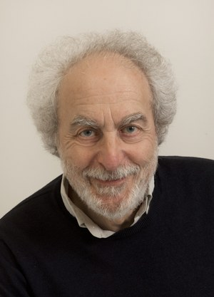

```{r setup, include=FALSE}
## got ? mins ##

# see https://github.com/rstudio-education/arm-workshop-rsc2019/blob/master/static/slides/xaringan.Rmd
knitr::opts_chunk$set(echo = FALSE, warning=FALSE, message=FALSE, error=FALSE, comment='', dpi=400, fig.align='center')
options(htmltools.dir.version = FALSE)
#xaringanExtra::use_xaringan_extra(c("tile_view", "animate_css", "tachyons"))
library(tidyverse)
library(dplyr)
library(ggplot2)
library(knitr)
library(flextable)
library(fontawesome) # from github: https://github.com/rstudio/fontawesome
cbbPalette <- c("#000000", "#E69F00", "#56B4E9", "#009E73", "#F0E442", "#0072B2", "#D55E00", "#CC79A7")
g.theme = theme_bw() + theme(panel.grid.minor = element_blank())
```

layout: true
  
---
name: xaringan-title
class: inverse, left, middle

.pull-left[

# .center[Bad statistics in medical research]

## .center[Adrian Barnett, QUT]

### .center[September 2023]

[`r fa(name = "twitter")` @aidybarnett](http://twitter.com/aidybarnett)  

[`r fa(name = "github")` @agbarnett](http://github.com/agbarnett)  

[`r fa(name = "blog")` Median Watch](https://medianwatch.netlify.app)

[`r fa(name = "paper-plane")` a.barnett@qut.edu.au](mailto:a.barnett@qut.edu.au)

]


.pull-right[

<!--- --->

```{r, out.width='150%'}
knitr::include_graphics(path='figures/nature_cover_statistics.jpg')
```

(Illustration by David Parkins)

]


---
background-image: url(figures/AcknowledgementTraditionalOwners.jpg)
background-size: cover


---

```{r, out.width='63%'}
knitr::include_graphics(path='figures/lancet_paper.jpg')
# DOI:  10.1016/S0140-6736(20)30566-3
```

<!--- * Incorrectly used logistic regression instead of survival analysis --->

* 813 hospitalised, 613 (75%) excluded because they were still hospitalised or not confirmed as infected

--

### Two implications:

* Bad research is not restricted to "low impact" journals

* Has been cited 30,000+ times: Many researchers do not recognise the serious statistical flaw

---

```{r, out.width='69%'}
knitr::include_graphics(path='figures/lancet_impact.jpg')
```

<!--- https://twitter.com/TheLancet/status/1542088311702962177 --->

```{r, include=FALSE}
# Lancet impact factor, and after removing the flawed paper
jif = (24196 + 75142)/ (275+215)
# remove flawed paper
jif_new = (24196 + 75142-14000)/ (275+215-1)
# how to change third decimal place, around 1 citation
```

<!--- Emphasis on publishing in top-tier journals is a huge driver of the reproducibility crisis --->
---

```{r, out.width='52%'}
knitr::include_graphics(path='figures/scrabble.jpg')
```

From [NPR](https://www.npr.org/sections/thetwo-way/2015/07/21/424980378/winner-of-french-scrabble-title-does-not-speak-french)

---
class: inverse

```{r, out.width='44%'}
knitr::include_graphics(path='figures/gauss.jfif')
```

(Image from _Wikipedia_)


---
## Marathon times

```{r, out.width='64%'}
knitr::include_graphics(path='figures/marathon_times.png')
```

#### From DOI: [10.1287/mnsc.2015.2417](https://doi.org/10.1287/mnsc.2015.2417)

---
## Qualitative descriptors for  area under the receiver operating characteristic curve (AUC) cut-offs

### "An AUC value of more than 0.9 was considered outstanding and 0.8-0.9 as excellent." [PMID35537614](https://pubmed.ncbi.nlm.nih.gov/35537614/)

--

### "An AUC of 0.5 suggests no discrimination, 0.7-0.8 is considered acceptable, more than 0.8-0.9 is considered excellent, and more than 0.9 is considered outstanding.'' [PMID34793687](https://pubmed.ncbi.nlm.nih.gov/34793687/)

--

### "Generally speaking, when the AUC value of a model is at the range of 0.7-0.8, the prediction ability of the model is superior. When the AUC value is at the range of 0.8-0.9, the prediction ability of the model is very good.'' [PMID31041192](https://pubmed.ncbi.nlm.nih.gov/31041192/)

---
class:center,middle


(from Visutrainment on giphy)

---
# AUC values

```{r, out.width='78%'}
knitr::include_graphics(path='figures/histogram_residuals_slide.jpg')
```

##### From DOI: [10.1186/s12916-023-03048-6](https://doi.org/10.1186/s12916-023-03048-6)

---
class: inverse
## How does it happen?

.pull-left[

```{r, out.width='98%'}
knitr::include_graphics(path='figures/retraction_watch1.jpg')
```

From [Retraction Watch](https://retractionwatch.com/2018/03/15/the-1-key-was-not-pressed-hard-enough-did-a-typo-kill-a-cancer-paper/)


]

.pull-right[

The sensitivity values were reported as 71% and 60% in the article, but it was later determined that they were 48% and 36%.

]


---
## Stop developing new diagnostic or prognostic models

```{r, out.width='47%'}
knitr::include_graphics(path='figures/Wynants.jpg')
```

DOI: [10.1136/bmj.m1328](https://www.bmj.com/content/369/bmj.m1328)

<!--- Stop developing prediction models (hard), talk about standard text in justification, talk about stochastic variability, rule out tests might still be useful, e.g. Troponin. Appreciate that data changes. Most predictive value comes from a few variables.--->

---
class:center, inverse, middle

# Medical research funders should no longer fund projects that plan to develop a prediction model unless a qualified statistician is a principal investigator

---
class: center
# P-values

```{r, out.width='32%'}
knitr::include_graphics(path='https://imgs.xkcd.com/comics/p_values.png')
```

(From _xkcd_)

---

```{r, out.width='58%'}
knitr::include_graphics(path='figures/gelman_age.png')
```

Hat-tip to [Andrew Gelman](https://statmodeling.stat.columbia.edu/)


---
class:inverse
## The evidence-base is horribly biased

```{r, out.width='60%'}
# from U:\Research\Projects\ihbi\aushsi\aushsi_barnetta\meta.research\text.mining\outside.confidence.intervals\figures\4_plot_z.R
knitr::include_graphics(path='figures/Z_plot.png')
```

Z-values extracted from confidence intervals in _Medline_ between 1976 and 2019

---
## Bad practice in Australia

.pull-left[

In the past three years how often have you: 

* Not attempted to publish a valid "negative" or "neutral" study = 25%
* Selected the statistical method that provided the desired result = 8% ...
* ... Rises to 30% when asking about witnessing this approach in others

From NHMRC [2019 Survey of research culture in Australian NHMRC-funded institutions](https://www.nhmrc.gov.au/file/15321/download?token=PivJ5dGE)

]

.pull-right[

<!--- from https://www.craigmarker.com/file-drawer-problem/ --->


]


---

<!--- registered reports --->

```{r, out.width='61%'}
knitr::include_graphics(path='figures/pbio.3000246.g001.png')
```

### DOI: [10.1371/journal.pbio.3000246.g001](https://journals.plos.org/plosbiology/article/figure?id=10.1371/journal.pbio.3000246.g001)

---
# Cut-and-paste methods

```{r, out.width='74%'}
knitr::include_graphics(path='figures/cut_and_paste.jpg')
```

### From DOI: [10.1371/journal.pone.0264360](https://journals.plos.org/plosone/article?id=10.1371/journal.pone.0264360)

--

#### Citation: "A P-value of < 0.05 was considered to be statistically significant."


---
class: top, center, inverse
background-image: url(figures/podium.jpg)
background-size: cover
### .left[Worst ever statistical methods section]

--

## .left[t-test]

--

## .right[SPSS]


<!--- http://www.anzctr.org.au/Trial/Registration/TrialReview.aspx?ACTRN=12617001415392 --->

--

## .center[SSPS]

<!--- https://www.anzctr.org.au/Trial/Registration/TrialReview.aspx?id=373697 --->


---
class: inverse

.pull-left[
 
]

.pull-right[
## "Many people think that all you need to do statistics is a computer and appropriate software." 

## Doug Altman
]


---

.pull-left[
## Slapdash research

]

.pull-right[

```{r, out.width='135%'}
knitr::include_graphics(path='figures/jama.jpg')
```

]

---
class: center
# Figures


```{r, out.width='65%'}
knitr::include_graphics(path='https://imgs.xkcd.com/comics/scientific_paper_graph_quality.png')
```


(From _xkcd_)

---
class: center, middle

```{r, out.width='77%'}
knitr::include_graphics(path='figures/bad_graph_pair.jpg')
```

<!--- From https://iopscience.iop.org/article/10.1088/1742-6596/2550/1/012013 --->

---
class: center, middle


---
class: center, middle


---
class: center, middle

```{r, out.width='98%'}
knitr::include_graphics(path='figures/awful_plot3.jfif')
```

---
class: center, middle

```{r, out.width='88%'}
knitr::include_graphics(path='figures/awful_plot4.jfif')
```

---
## Stop using pie charts

```{r, out.width='62%'}
knitr::include_graphics(path='figures/pie_charts.jfif')
```

From https://twitter.com/MaxCRoser/status/857389434756505600


---
class:center, inverse, middle

.pull-left[

# This is everybody's problem and nobody's problem

]

.pull-right[

### Grayrigg derailment


By Lawrence Clift - http://www.lawrencecliftphotography.co.uk/

]

<!--- pathetic amount spent on quality control --->

---
class: center, middle

```{r, out.width='90%'}
knitr::include_graphics(path='figures/nature_cover.jpg')
```

<!--- journals too often promote publishing “mansions of straw rather than houses of
brick.” Bill Kaelin --->

(Illustration by David Parkins)

---
# Quality control

.pull-left[

### Randomly audit 100 papers per year from each university & research institute

### Statisticians check the analysis and see if they can reproduce the results

<!--- ### Reviewers read the papers and assess originality, reproducibility and translation into practice --->

]

.pull-right[


Photo by <a href="https://unsplash.com/@battlecreekcoffeeroasters?utm_source=unsplash&utm_medium=referral&utm_content=creditCopyText">Battlecreek Coffee Roasters</a> on <a href="https://unsplash.com/photos/i22gbC3gFm4?utm_source=unsplash&utm_medium=referral&utm_content=creditCopyText">Unsplash</a>
  
  
]

DOI: [10.1371/journal.pone.0195613](https://journals.plos.org/plosone/article?id=10.1371/journal.pone.0195613)

---
class:inverse, center

# Statistical robots are coming


This is not AI

<!--- given up trying to fix things myself --->

---
### Yuhji Saitoh

```{r, out.width='75%'}
knitr::include_graphics(path='figures/saitoh_tables.png')
```

---

```{r, out.width='70%'}
# from 4_model_cumulative.R
knitr::include_graphics(path='figures/saitoh_simple.jpg')
```

---
class:center, middle
```{r, out.width='65%'}
knitr::include_graphics(path='figures/murdoch.jpg')
```

(from [ABC news](https://www.abc.net.au/news/2014-12-12/university-of-queensland-professor-on-fraud-charges/5964476))

---
class: inverse
# The continuing scandal of bad medical research

.pull-left[

* 1994: Doug Altman wrote about ‘The scandal of poor medical research’

* 2015: Doug: Wish I'd said 'bad'

* 2022: 1013 out of 1659 at high risk of bias. Estimated cost of bad trials was £726 million to £8 billion, DOI: [10.1186/s13063-022-06415-5](https://trialsjournal.biomedcentral.com/articles/10.1186/s13063-022-06415-5)
]

.pull-right[



##### Photo by Oxford Clinical Trials Research Unit

]

---
class: inverse, center, middle

# More competence less excellence

---

```{r, out.width='79%'}
knitr::include_graphics(path='figures/NHMRC.jpg')
```

---
class:inverse
## More education

### "Thanks for giving such an interesting and thought provoking presentation yesterday ... I’d be really interested in discussing with you further whether there is an opportunity to actually build something similar to what you presented yesterday.''

--

### Four weeks later ...

### "I’ve just been told that it is too expensive per head'' ($550 per person)


---
background-image: url(figures/AIMOS_2023.jpg)
background-size: cover
