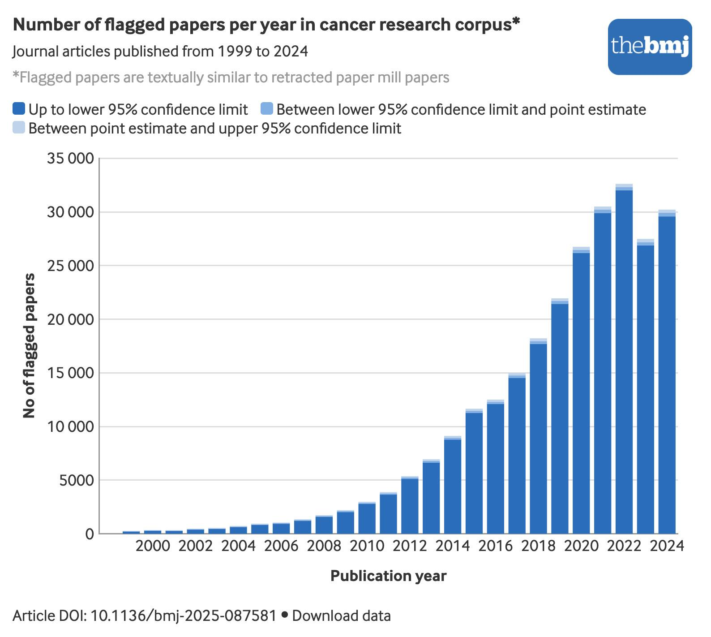
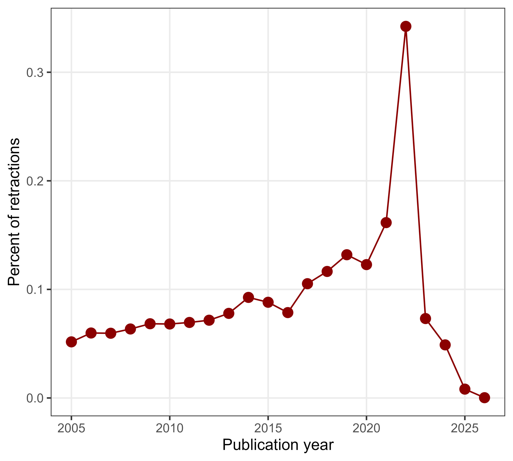
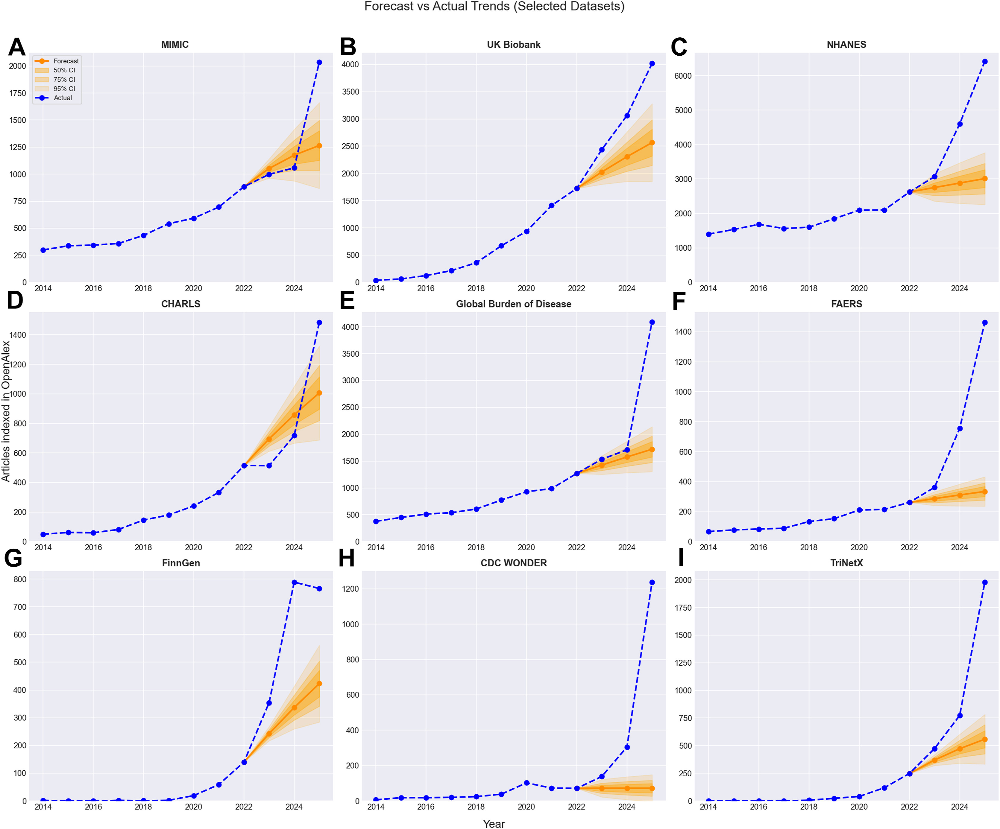
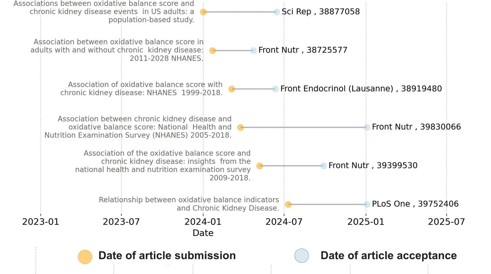
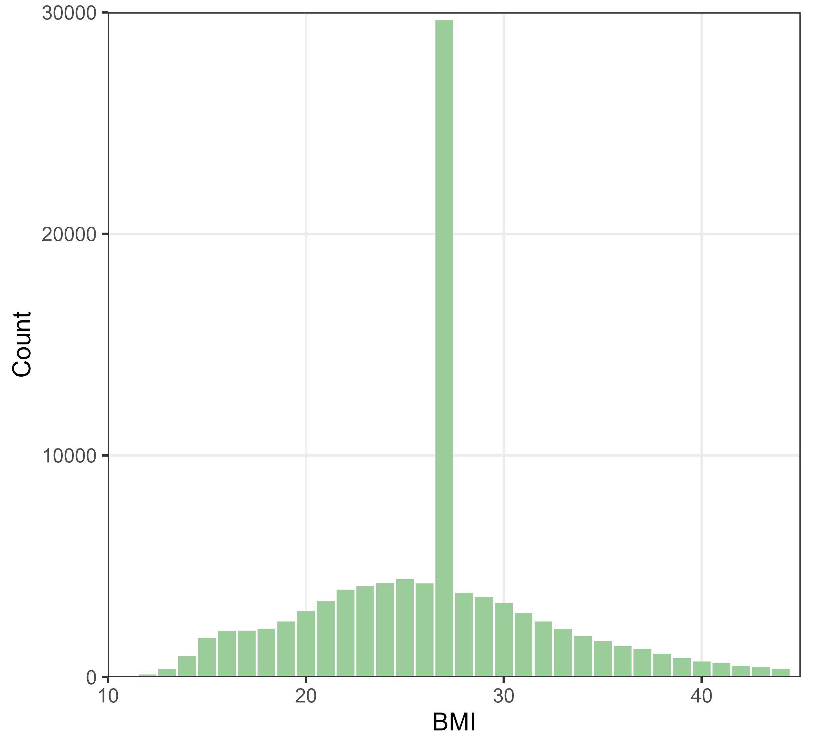
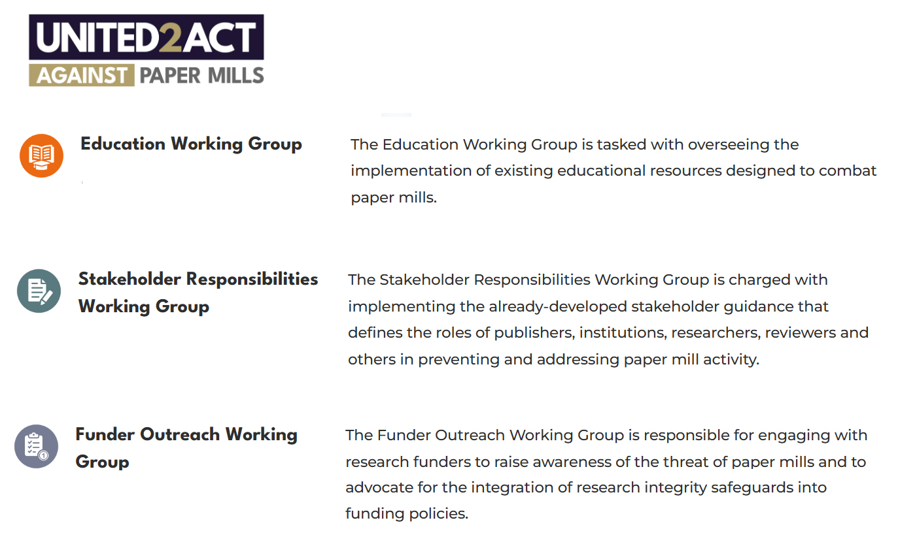
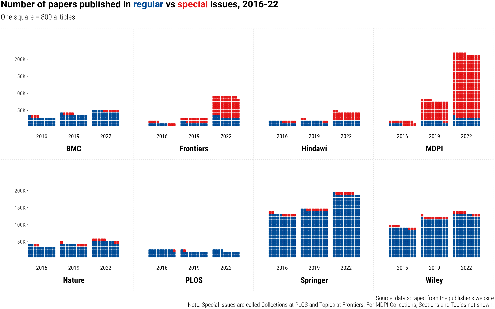
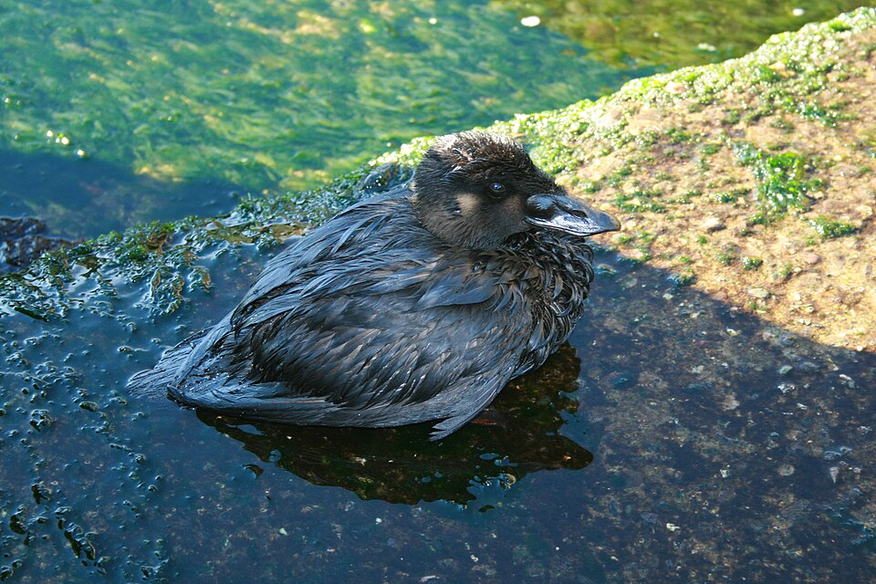

# <xx-small style="color:transparent">Oil spill</xx-small>{background-image='figures/alex-albert-p7kl7eTp6dM-unsplash.jpg' background-opacity=0.75 background-size='cover'}

"AI slop is an oil spill in our digital oceans"

[Katelyn Chedraoui](https://www.cnet.com/tech/services-and-software/features/ai-slop-is-destroying-the-internet-these-are-the-people-fighting-to-save-it/)

<!-- instead of aside -->
    
Photo by <a href="https://unsplash.com/@alexalbert?utm_source=unsplash&utm_medium=referral&utm_content=creditCopyText">Alex Albert</a> on <a href="https://unsplash.com/photos/a-duck-swimming-in-a-pond-p7kl7eTp6dM?utm_source=unsplash&utm_medium=referral&utm_content=creditCopyText">Unsplash</a>

<!--- aim for 30 mins, then Q&A --->

## How deep?{background-color='white'}

{width=640px}

## How much is cleaned up?{background-color='white'}

<!--- https://www.nature.com/articles/d41586-022-02071-6 --->

:::: columns
::: {.column width="60%"}
* Retractions are increasing, but not enough

<!--- from retractions_over_time.R--->
{width=500px}
:::
  
::: {.column width="40%"}
{width=300px}

<small>Ivan Oransky</small>

<small>Image and data from [RetractionWatch](https://retractionwatch.com/meet-the-retraction-watch-staff/about/)</small>
:::
::::

## Go slow{background-image='figures/david-gomez-na--v-QNl0M-unsplash.jpg' background-opacity=0.2 background-size='cover'}

<small>Aref, H.M., et al. A randomized pilot study of the efficacy and safety of loading ticagrelor in acute ischemic stroke. _Neurol Sci_ **44**, 765–771 (2023). </small>

<small>7 April 2026</small> 

<small>Dear Dr. Barnett,</small> 

<small>Thank you for alerting us to your concerns about this publication. **We take any issues raised seriously**. Neurological Sciences is a member of the Committee on Publication Ethics (COPE). We will investigate this matter in line with COPE guidelines.</small> 

<small>etc</small>

<small>Publisher, Medicine and Life Sciences - Journals, Springer Nature</small>

::::aside
Photo by <a href="https://unsplash.com/@dcanadianphotographer?utm_source=unsplash&utm_medium=referral&utm_content=creditCopyText">David Gomez</a> on <a href="https://unsplash.com/photos/a-brown-and-white-sloth-hanging-from-a-tree-na--v-QNl0M?utm_source=unsplash&utm_medium=referral&utm_content=creditCopyText">Unsplash</a>
::::

## <xx-small style="color:transparent">Where</xx-small>{background-color='white'}

:::: columns
::: {.column width="40%"}
<Large>Where are the spills?</Large>
:::
  
::: {.column width="62%"}
{.absolute top="10"
right="20"}
:::
::::

## Drill, baby, drill!{background-color='white'}

{width=630px}

::::aside

DOI: [10.1016/j.jclinepi.2026.112203](https://www.sciencedirect.com/science/article/pii/S0895435626000788)

::::

## Turn the handle{background-color='#544931'}

:::: columns
::: {.column width="70%"}
{width=780px}
:::
  
::: {.column width="30%"}

:::
::::

::::aside
video from giphy; DOI: [10.1186/s12916-025-04569-y](https://link.springer.com/article/10.1186/s12916-025-04569-y)
::::

## Data too open?{background-image='figures/muhammad-zaqy-al-fattah-Lexcm-6FHRU-unsplash.jpg' background-opacity=0.4 background-size='cover'}

* With Matt Spick (Uni of Surrey), we created a paper using _Prism_ (_OpenAI_) in 30 minutes with no human input

::::aside
[LSE Impact](https://blogs.lse.ac.uk/impactofsocialsciences/2026/03/17/research-integrity-is-locked-into-an-arms-race-with-agentic-ai-slop/); Photo by <a href="https://unsplash.com/@dizzydizz?utm_source=unsplash&utm_medium=referral&utm_content=creditCopyText">Muhammad Zaqy Al Fattah</a> on <a href="https://unsplash.com/photos/silver-padlock-Lexcm-6FHRU?utm_source=unsplash&utm_medium=referral&utm_content=creditCopyText">Unsplash</a>
      
::::

## Data too open?{visibility='uncounted' background-image='figures/muhammad-zaqy-al-fattah-Lexcm-6FHRU-unsplash.jpg' background-opacity=0.4 background-size='cover'}

* With Matt Spick (Uni of Surrey), we created a paper using _Prism_ (_OpenAI_) in 30 minutes with no human input

* _Paper Orchestra_ (_Google_), produces a submission-ready manuscript with figures and verified citations in about 40 minutes

<!--- https://yiwen-song.github.io/paper_orchestra/ --->

::::aside
[LSE Impact](https://blogs.lse.ac.uk/impactofsocialsciences/2026/03/17/research-integrity-is-locked-into-an-arms-race-with-agentic-ai-slop/); Photo by <a href="https://unsplash.com/@dizzydizz?utm_source=unsplash&utm_medium=referral&utm_content=creditCopyText">Muhammad Zaqy Al Fattah</a> on <a href="https://unsplash.com/photos/silver-padlock-Lexcm-6FHRU?utm_source=unsplash&utm_medium=referral&utm_content=creditCopyText">Unsplash</a>
::::

## Data slop{background-color='white'}

:::: columns
::: {.column width="50%"}

"A smart camera located in patient rooms has been used to collect images"

{width=400}

:::
::: {.column width="50%"}

:::
::::
  
::::aside

DOI:[10.1038/s41598-025-28513-5](https://www.nature.com/articles/s41598-025-28513-5) 

::::

## Data slop{background-color='white' visibility="uncounted"}

:::: columns
::: {.column width="50%"}

"A smart camera located in patient rooms has been used to collect images"

{width=400}

:::
::: {.column width="50%"}

"An authoritative dataset was used as the research object"

{width=400}

:::
::::
  
::::aside

DOI:[10.1038/s41598-025-28513-5](https://www.nature.com/articles/s41598-025-28513-5) & DOI:[10.1038/d41586-026-00697-4](https://www.nature.com/articles/d41586-026-00697-4)

::::

# Solutions?{background-color='#d5c3a3'}

::::aside
from giphy
::::

## Leave paper trails{background-color='white'}

:::: aside

from BoxMedia on giphy

::::

## Take precautations{background-image='figures/charles-betito-filho-ccYgXLar_1I-unsplash.jpg' background-opacity=0.4 background-size='cover'}

ArXiv is now:

* Limiting submissions from computer science

* Banning users for a year if they submit hallucinated references

::::aside
Photo by <a href="https://unsplash.com/@cbetito?utm_source=unsplash&utm_medium=referral&utm_content=creditCopyText">Charles Betito Filho</a> on <a href="https://unsplash.com/photos/a-man-in-a-shiny-silver-suit-with-a-hood-on-ccYgXLar_1I?utm_source=unsplash&utm_medium=referral&utm_content=creditCopyText">Unsplash</a>
::::

## Spend some money{background-color='white'}

{width=870px}

::::aside

From [united2act](https://united2act.org/)

::::

## Coining it in{background-color='white'}

{width=790}

::::aside

DOI: [10.1162/qss_a_00327](https://doi.org/10.1162/qss_a_00327)

::::

## Money for quality control{background-image='figures/adam-nir-wTO6MWpMrJk-unsplash.jpg' background-opacity=0.15 background-size='cover'}

* The _American Society for Quality_ states that organisations typically spend 10 to 15% of their operating costs on quality-related costs 

* For the NHMRC budget only, this would mean $740 million per year on quality-related work

* What we actually spend is around $1 million

::::aside
Photo by <a href="https://unsplash.com/@adamnir?utm_source=unsplash&utm_medium=referral&utm_content=creditCopyText">Adam Nir</a> on <a href="https://unsplash.com/photos/a-close-up-of-a-one-dollar-bill-wTO6MWpMrJk?utm_source=unsplash&utm_medium=referral&utm_content=creditCopyText">Unsplash</a>
::::

## Money for quality control{visibility="uncounted" background-image='figures/adam-nir-wTO6MWpMrJk-unsplash.jpg' background-opacity=0.15 background-size='cover'}

* The _American Society for Quality_ states that organisations typically spend 10 to 15% of their operating costs on quality-related costs 

* For the NHMRC budget only, this would mean $740 million per year on quality-related work

* What we actually spend is around $1 million

* Publishers cry poor, but last year the mega-publisher _Elsevier_ made GBP £1.2 billion in profit

::::aside
Photo by <a href="https://unsplash.com/@adamnir?utm_source=unsplash&utm_medium=referral&utm_content=creditCopyText">Adam Nir</a> on <a href="https://unsplash.com/photos/a-close-up-of-a-one-dollar-bill-wTO6MWpMrJk?utm_source=unsplash&utm_medium=referral&utm_content=creditCopyText">Unsplash</a>
::::

## <xx-small style="color:transparent">Turn down the heat</xx-small>{background-image='figures/nature_articles.jpg' background-opacity=1 background-color='white' background-size='contain'}

## Name games{background-color='white'}

<!--- from https://orcid.org/0000-0001-8526-5486 --->

## Old world cheats{background-color='#544933'}

::::aside
Portrait painted by John Cooke in 1915, public domain art
::::

## How did end up here?{background-color='#a9bdeb'}

:::: columns
::: {.column width="50%"}
* I am not a wannabe policeman
:::
  
::: {.column width="50%"}

:::
::::

::::aside
from dotdave on giphy
::::

## What's next?{background-color='#26435d'}

::::aside
<a href="https://commons.wikimedia.org/wiki/File:Oiled_diving_duck.JPG">Brocken Inaglory</a>, <a href="https://creativecommons.org/licenses/by-sa/4.0">CC BY-SA 4.0</a>, via Wikimedia Commons
::::

## End on a positive

{width=500px}

:::: aside
From Socceroos instagram
::::
