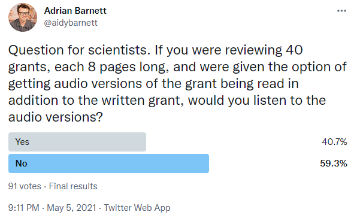

```{r setup, include=FALSE}
# see https://github.com/rstudio-education/arm-workshop-rsc2019/blob/master/static/slides/xaringan.Rmd
knitr::opts_chunk$set(echo = FALSE, warning=FALSE, message=FALSE, error=FALSE, comment='', dpi=400, fig.align='center')
options(htmltools.dir.version = FALSE)
#xaringanExtra::use_xaringan_extra(c("tile_view", "animate_css", "tachyons"))
library(tidyverse)
library(dplyr)
library(ggplot2)
library(knitr)
library(fontawesome) # from github: https://github.com/rstudio/fontawesome
cbbPalette <- c("#000000", "#E69F00", "#56B4E9", "#009E73", "#F0E442", "#0072B2", "#D55E00", "#CC79A7")
```

layout: true
  
---
name: xaringan-title
class: inverse, left, middle

# .center[Experimental methods and cost measurement for different funding modes]

## .center[Adrian Barnett, Queensland University of Technology, Brisbane, Australia]

### .center[2 December 2021]

[`r fa(name = "twitter")` @aidybarnett](http://twitter.com/aidybarnett)  

[`r fa(name = "github")` @agbarnett](http://github.com/agbarnett)  

[`r fa(name = "blog")` Median Watch](https://medianwatch.netlify.app)

[`r fa(name = "paper-plane")` a.barnett@qut.edu.au](mailto:a.barnett@qut.edu.au)


---
background-image: url(figures/AcknowledgementTraditionalOwners.jpg)
background-size: cover

---
class:center, middle, inverse

# Uncertainty


---
# The problem: noise in funding decisions

### Study of American Institute of Biological Sciences:

### - 23% of total variance in reviewers' scores was due to applications

### - 77% was due to the reviewers and noise

##### Gallo et al, The Influence of Peer Reviewer Expertise on the Evaluation of Research Funding Applications [PLOS ONE](https://journals.plos.org/plosone/article?id=10.1371/journal.pone.0165147) 2016


---
# Single additional question for reviewers

#### We want to know how certain you were about your score and if you considered other scores. Can you estimate your probability of selecting each score? 

#### Please provide your answers as percentages.
```{r}
library(knitr)
table = read.table(header = TRUE, sep=',', text='
Score,Percent
7,
6,
5,
4,
3,
2,
1,
Total,100%')
kable(table)
```

---
# Potential insights

### Does uncertainty vary by:

###* Reviewers' characteristics, e.g., gender and seniority
###* Review criteria, e.g., track record vs innovation
###* Application, e.g., readability score, word count

--

### Ultimate aim to target and reduce uncertainty

### Need around 400 responses

---
class: center, middle

# Video and audio


---
# Process

### Recorded Powerpoint presentations instead of main text

### Videos can incorporate animations/videos, e.g., showing a new lab technique

--

### Could reduce application time? Could reduce review time?

### Could increase reviewer understanding?

--

### Could increase biases by gender or race?

### Could preference those with slick presentation skills?

##### Doran et al, The future of grant proposals is video [Nature](https://www.nature.com/articles/d41586-021-00341-3) 2021

---
# Video study

## Re-assess previously applications that were close to the funding line

## Randomly assign 50 reviewers per group to:

###- Text only

###- Video only

###- Text & Video

--

## Look for a reduction in the "grey zone" where the decision to fund is mixed

## Also collect data on time and reviewer satisfaction

---
class:inverse
# Audio pilot study

## Provide audio versions of written grants to reviewers

## Done using an automated voice so all applications sound the same; also cheap and easy

## Did reviewers use them? Did they find them useful? 

## Were more reviews completed? And more on time?

---
# Unscientific poll



---
class: center, middle

# Career disruption


---
# Career disruption

#### Those with career disruption often have to share personal details to account for the gap in their CV

#### 12% of researchers in a recent survey said they don't share their career disruption, with a common reason being because they believe it will harm their chances of being funded

#### Bigger issue for women

#### Need to make it easier for researchers to claim career disruption

--

#### Pilot a separate medical/social panel to assess career disruption