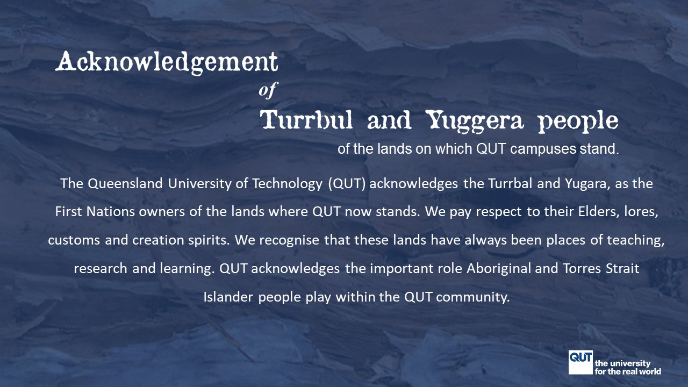
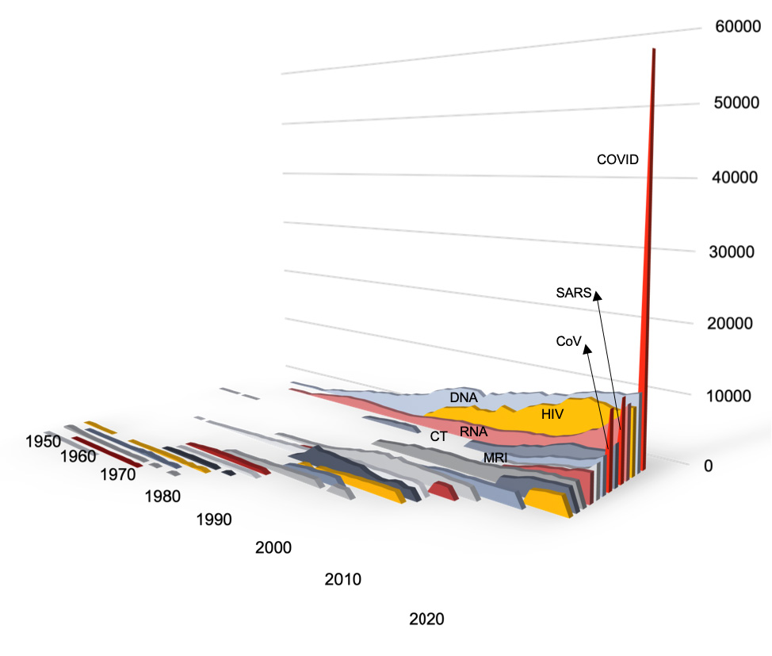

class: center, middle

```{r setup, include=FALSE}
# see https://github.com/rstudio-education/arm-workshop-rsc2019/blob/master/static/slides/xaringan.Rmd
knitr::opts_chunk$set(echo = FALSE, warning=FALSE, message=FALSE, error=FALSE, comment='', dpi=400, fig.align='center')
options(htmltools.dir.version = FALSE)
#xaringanExtra::use_xaringan_extra(c("tile_view", "animate_css", "tachyons"))
library(tidyverse)
library(dplyr)
library(ggplot2)
library(knitr)
library(fontawesome) # from github: https://github.com/rstudio/fontawesome
```

```{r, out.width='120%'}

```

<!--- 10 mins max --->

---
## Epidemiological imposter

```{r, out.width='80%'}
knitr::include_graphics("https://media.giphy.com/media/l0HU4eYbAewkjcOwE/giphy.gif")
```

---
class: inverse
## High pressure modelling

<!--- Frightening moment --->
<!--- Mass graves in New York; no oxygen in India --->
<!--- Predict when local hospital would run out of PPE --->

```{r, out.width='70%'}
knitr::include_graphics("https://media.giphy.com/media/gYxsHpXzjiZq1qMKPK/giphy.gif")
```

---
## Boom in COVID research

```{r, out.width='60%'}
# change, e.g., "https://raw.githubusercontent.com/agbarnett/talks/master/AIMOS/figures/cakes.jpg"

```

"COVID" is the sixth most popular acronym of all time, surpassing "AIDS", "PCR" and "MRI" in just one year

---
## Deluge of poor quality papers

- March 2020 _Lancet_ paper<sup>1</sup> of in-hospital mortality which excluded `r round(100*613/813)`% of the sample because they were still in hospital

- _Surgisphere_ scandal

- Over 200 COVID prediction models<sup>2</sup>, almost all have been "useless" (Laure Wynants)

.small[<sup>1</sup> Zhou et al, Clinical course and risk factors for mortality of adult inpatients with COVID-19 in Wuhan, China: a retrospective cohort study]

.small[<sup>2</sup> Wynants et al, [Living systematic review](https://www.bmj.com/content/369/bmj.m1328) at the _BMJ_]

---
## For the next crisis

#### Two independent teams doing all epidemiological modelling

.pull-left[
```{r}
knitr::include_graphics("https://images.newscientist.com/wp-content/uploads/2019/01/07150651/gettyimages-656318802.jpg")
```
]

.pull-right[
```{r}
knitr::include_graphics("https://i.insider.com/55e9c2ae9dd7cc15008b8524")
```
]

---
class:inverse
## Fires 

```{r, out.width='90%'}
knitr::include_graphics("https://live-production.wcms.abc-cdn.net.au/d2e7880c0ebcde06be415aa2044f9e83")
```

<!--- - Show failed grants. In all that modelling, I wouldn't have done anything so extreme.
Perhaps more of an appetite for worst-case scenarios. --->

--

### "Now is not the time to talk about climate change."

---
## Sad change

.pull-left[


]

.pull-right[

* Serious national shortage of statistical expertise

* Recent job cuts at 4 Australian universities

* Government's post-COVID resilience assessment asked for "machine learning methods" like linear and logistic regression 

]

<!---
Instructions:

•	Professional reflections

•	Personal reflections

•	Q: What has changed since October 2020

•	Q: What will I carry forward, Answer: Model more extreme scenarios
--->
