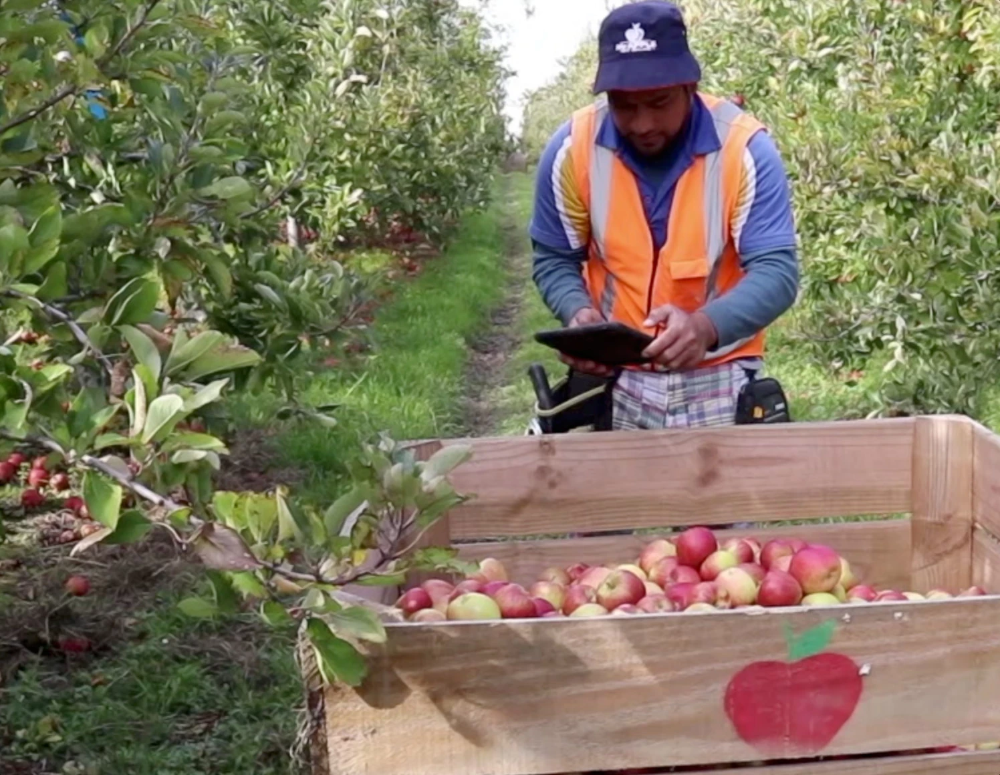

```{r setup, include=FALSE}
## got ? mins ##

# see https://github.com/rstudio-education/arm-workshop-rsc2019/blob/master/static/slides/xaringan.Rmd
knitr::opts_chunk$set(echo = FALSE, warning=FALSE, message=FALSE, error=FALSE, comment='', dpi=400, fig.align='center')
options(htmltools.dir.version = FALSE)
#xaringanExtra::use_xaringan_extra(c("tile_view", "animate_css", "tachyons"))
library(tidyverse)
library(dplyr)
library(ggplot2)
library(knitr)
library(flextable)
library(fontawesome) # from github: https://github.com/rstudio/fontawesome
cbbPalette <- c("#000000", "#E69F00", "#56B4E9", "#009E73", "#F0E442", "#0072B2", "#D55E00", "#CC79A7")
g.theme = theme_bw() + theme(panel.grid.minor = element_blank())
```

layout: true
  
---
name: xaringan-title
class: inverse, left, middle

.pull-left[

# .center[Bad statistics in medical research]

## .center[Adrian Barnett, QUT]

### .center[September 2022]

[`r fa(name = "twitter")` @aidybarnett](http://twitter.com/aidybarnett)  

[`r fa(name = "github")` @agbarnett](http://github.com/agbarnett)  

[`r fa(name = "blog")` Median Watch](https://medianwatch.netlify.app)

[`r fa(name = "paper-plane")` a.barnett@qut.edu.au](mailto:a.barnett@qut.edu.au)

]


.pull-right[

<!--- --->

```{r, out.width='150%'}
knitr::include_graphics(path='figures/nature_cover_statistics.jpg')
```

(Illustration by David Parkins)

]


---
background-image: url(figures/AcknowledgementTraditionalOwners.jpg)
background-size: cover

---

```{r, out.width='63%'}
knitr::include_graphics(path='figures/lancet_paper.jpg')
# DOI:  10.1016/S0140-6736(20)30566-3
```

<!--- * Incorrectly used logistic regression instead of survival analysis --->

* 813 hospitalised, 613 (75%) excluded because they were still hospitalised or not confirmed as infected

--

### Two implications:

* Bad research is not restricted to "low impact" journals

* Has been cited 25,000+ times: Many researchers do not recognise the serious statistical flaw

---

```{r, out.width='69%'}
knitr::include_graphics(path='figures/lancet_impact.jpg')
```

<!--- https://twitter.com/TheLancet/status/1542088311702962177 --->

```{r, include=FALSE}
# Lancet impact factor, and after removing the flawed paper
jif = (24196 + 75142)/ (275+215)
# remove flawed paper
jif_new = (24196 + 75142-14000)/ (275+215-1)
# how to change third decimal place, around 1 citation
```

<!--- Emphasis on publishing in top-tier journals is a huge driver of the reproducibility crisis --->
---

```{r, out.width='52%'}
knitr::include_graphics(path='figures/scrabble.jpg')
```

From [NPR](https://www.npr.org/sections/thetwo-way/2015/07/21/424980378/winner-of-french-scrabble-title-does-not-speak-french)

---
class: inverse

```{r, out.width='44%'}
knitr::include_graphics(path='figures/gauss.jfif')
```

(Image from _Wikipedia_)


---
# Continuous data and the normal assumption

```{r, fig.height=3.5}
TeachingDemos::char2seed('exeter')
N = 300
mean1 = 110
mean2 = 99
data = data.frame(group = rbinom(n=N, size=1, prob=0.5),
                  bp = rnorm(n=N, mean=0, sd=4)) %>%
  mutate(mean = ifelse(group==0, mean1, mean2),
         bp = mean + bp)
#
hplot = ggplot(data, aes(x=bp))+
  geom_histogram(col='grey33', fill='skyblue')+
  xlab('Systolic BP')+
  g.theme
hplot
```

---
# Continuous data and the normal assumption

```{r, fig.height=3.5}
hplot = ggplot(data, aes(x=bp, fill=factor(group)))+
  geom_histogram(col='grey33')+
  scale_fill_manual(NULL, values=c('darkseagreen3','dodgerblue'))+
  xlab('Systolic BP')+
  g.theme+
  theme(legend.position = 'none')
hplot
```

---
class: center
# P-values

```{r, out.width='32%'}
knitr::include_graphics(path='https://imgs.xkcd.com/comics/p_values.png')
```

(From _xkcd_)

---

```{r, out.width='58%'}
knitr::include_graphics(path='figures/gelman_age.png')
```

Hat-tip to [Andrew Gelman](https://statmodeling.stat.columbia.edu/)

---
# Quiz question
<!--- Add a menti with options --->

#### https://www.menti.com/5624oqzron

#### Go to www.menti.com and use the code 3205 7080

The P value is the probability ...

* that the null hypothesis is true

* that the alternative hypothesis is true

* that the study worked

* that the results happened by chance

* of obtaining the observed or more extreme results if the alternative hypothesis is true

---
class:inverse
## The evidence-base is horribly biased

```{r, out.width='60%'}
# from U:\Research\Projects\ihbi\aushsi\aushsi_barnetta\meta.research\text.mining\outside.confidence.intervals\figures\4_plot_z.R
knitr::include_graphics(path='figures/Z_plot.png')
```

Z-values extracted from confidence intervals in _Medline_ between 1976 and 2019

---
## Bad practice in Australia

.pull-left[

In the past three years how often have you: 

* Not attempted to publish a valid "negative" or "neutral" study = 25%
* Selected the statistical method that provided the desired result = 8% ...
* ... Rises to 30% when asking about witnessing this approach in others

From NHMRC [2019 Survey of research culture in Australian NHMRC-funded institutions](https://www.nhmrc.gov.au/file/15321/download?token=PivJ5dGE)

]

.pull-right[

<!--- from https://www.craigmarker.com/file-drawer-problem/ --->


]


---
## Abandon p-values and statistical significance 

```{r, out.width='50%'}
# from pval_diagram_stages.R
knitr::include_graphics(path='figures/pval_journey1.jpg')
```

---
## Abandon p-values and statistical significance 

```{r, out.width='50%'}
knitr::include_graphics(path='figures/pval_journey2.jpg')
```

---
## Abandon p-values and statistical significance 

```{r, out.width='50%'}
knitr::include_graphics(path='figures/pval_journey3.jpg')
```

---
## Abandon p-values and statistical significance 

```{r, out.width='50%'}
knitr::include_graphics(path='figures/pval_journey4.jpg')
```

False positive probability = 9 / (9 + 12) = 43%. See [DOI: 10.1098/rsos.140216](https://royalsocietypublishing.org/doi/10.1098/rsos.140216) for details.

---
class:inverse
## Abandon p-values and statistical significance 

.pull-left[
## "Significance tests are popular with non-statisticians, who like to feel certainty where no certainty exists" (Yates and Healy 1964)

DOI: [10.2307/2344003](https://shibbolethsp.jstor.org/start?entityID=https%3A%2F%2Fidp.qut.edu.au%2Fentity&dest=https://www.jstor.org/stable/2344003&site=jstor)

]

.pull-right[

```{r, out.width='60%'}
# from psa.diagram.R
knitr::include_graphics(path='figures/Yates_Fisher_Cochran.jpg')
```

Yates, Fisher and Cochran

(Source: Barry Eagel, _Wikimedia Commons_)

]

---
## Most studies are under-powered

```{r, out.width='52%'}
# from code_from_erik.rmd
knitr::include_graphics(path='figures/power_histogram.jpg')
```

* Actual power estimated from 20,000 randomised controlled trials in the Cochrane database

DOI: [10.1111/1740-9713.01587](https://rss.onlinelibrary.wiley.com/doi/full/10.1111/1740-9713.01587)


---

<!--- registered reports --->

```{r, out.width='61%'}
knitr::include_graphics(path='figures/pbio.3000246.g001.png')
```

DOI: [https://doi.org/10.1371/journal.pbio.3000246.g001](https://journals.plos.org/plosbiology/article/figure?id=10.1371/journal.pbio.3000246.g001)


---
class: inverse, center, middle


---
## Stop developing new diagnostic or prognostic models

```{r, out.width='47%'}
knitr::include_graphics(path='figures/Wynants.jpg')
```

DOI: [10.1136/bmj.m1328](https://www.bmj.com/content/369/bmj.m1328)

<!--- Stop developing prediction models (hard), talk about standard text in justification, talk about stochastic variability, rule out tests might still be useful, e.g. Troponin. Appreciate that data changes. Most predictive value comes from a few variables.--->

---
class: inverse

```{r, out.width='62%'}
knitr::include_graphics(path='figures/prediction_flow1.png')
```

---
class: inverse

```{r, out.width='68%'}
knitr::include_graphics(path='figures/prediction_flow2.png')
```

From [Maarten Van Smeden](https://twitter.com/MaartenvSmeden/status/1561276708304609281/)

---
class:center, inverse, middle

## Medical research funders should no longer fund projects that plan to develop a prediction model unless a qualified statistician is a principal investigator


---
class: top, center, inverse
background-image: url(figures/podium.jpg)
background-size: cover
### .left[Worst ever statistical methods section]

--

## .left[t-test]

--

## .right[SPSS]


<!--- http://www.anzctr.org.au/Trial/Registration/TrialReview.aspx?ACTRN=12617001415392 --->

--

## .center[SSPS]

<!--- https://www.anzctr.org.au/Trial/Registration/TrialReview.aspx?id=373697 --->


---
class: inverse

.pull-left[
 
]

.pull-right[
## "Many people think that all you need to do statistics is a computer and appropriate software." 

## Doug Altman
]


---
class: center
# Figures


```{r, out.width='65%'}
knitr::include_graphics(path='https://imgs.xkcd.com/comics/scientific_paper_graph_quality.png')
```


(From _xkcd_)

---
class: center, middle


---
class: center, middle


---
class: center, middle

```{r, out.width='98%'}
knitr::include_graphics(path='figures/awful_plot3.jfif')
```

---
class: center, middle

```{r, out.width='88%'}
knitr::include_graphics(path='figures/awful_plot4.jfif')
```

---
## Stop using pie charts

```{r, out.width='62%'}
knitr::include_graphics(path='figures/pie_charts.jfif')
```

From https://twitter.com/MaxCRoser/status/857389434756505600


---
class:center, inverse, middle

.pull-left[

# This is everybody's problem and nobody's problem

]

.pull-right[

### Grayrigg derailment


By Lawrence Clift - http://www.lawrencecliftphotography.co.uk/

]

<!--- pathetic amount spent on quality control --->

---
class: center, middle

```{r, out.width='90%'}
knitr::include_graphics(path='figures/nature_cover.jpg')
```

<!--- journals too often promote publishing “mansions of straw rather than houses of
brick.” Bill Kaelin --->

(Illustration by David Parkins)

---
# Quality control

.pull-left[

### Randomly audit 100 papers per year from each university & research institute

### Statisticians check the analysis and see if they can reproduce the results

<!--- ### Reviewers read the papers and assess originality, reproducibility and translation into practice --->

]

.pull-right[



]

DOI: [10.1371/journal.pone.0195613](https://journals.plos.org/plosone/article?id=10.1371/journal.pone.0195613)

---
class:inverse, center

# Statistical robots are coming


This is not AI

<!--- given up trying to fix things myself --->

---
### Yuhji Saitoh

```{r, out.width='75%'}
knitr::include_graphics(path='figures/saitoh_tables.png')
```

---
class:center, middle
```{r, out.width='70%'}
knitr::include_graphics(path='figures/smyth.png')
```

(from [ABC news](https://www.abc.net.au/news/2022-01-11/qld-cancer-researcher-mark-smyth-fabricated-data-review-finds/100750208))

---

```{r, out.width='70%'}
# from 4_model_cumulative.R
knitr::include_graphics(path='figures/saitoh_simple.jpg')
```

---
class: inverse
# The continuing scandal of bad medical research

.pull-left[

* 1994: Doug Altman wrote about ‘The scandal of poor medical research’

* 2015: Doug: Wish I'd said 'bad'

* 2022: 1013 out of 1659 at high risk of bias. Estimated cost of bad trials was £726 million to £8 billion, DOI: [10.1186/s13063-022-06415-5](https://trialsjournal.biomedcentral.com/articles/10.1186/s13063-022-06415-5)
]

.pull-right[


##### By Oxford Clinical Trials Research Unit

]

