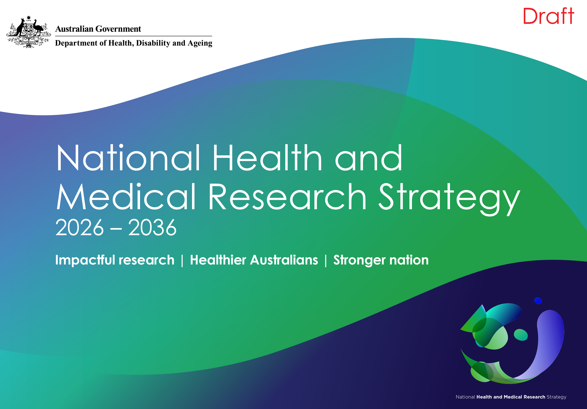
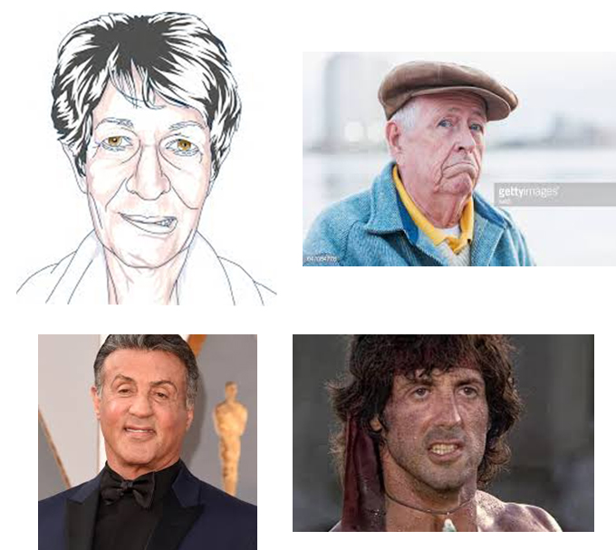

## National health and medical research strategy, August 2025

:::: columns
::: {.column width="60%"}

Chair: Rosemary Huxtable

* 
Improve data sharing and data access to support efficient research processes

* 
Streamline processes related to [...] data sharing

* 
Building capability in emerging technologies, AI and data, that is accessible and linked

:::
  
::: {.column width="40%"}

:::
::::
  
:::: aside
Report [here](https://www.nhmrc.gov.au/about-us/publications/draft-national-health-and-medical-research-strategy)
::::

## Barriers{background-image='figures/markus-spiske-dMh1A35w_BE-unsplash.jpg' background-opacity=0.4 background-size='cover'}

* Lack of skills in AI, statistics and data management

* Understanding of causality

::::aside
Photo by <a href="https://unsplash.com/@markusspiske?utm_source=unsplash&utm_medium=referral&utm_content=creditCopyText">Markus Spiske</a> on <a href="https://unsplash.com/photos/a-bird-sitting-on-top-of-a-chain-link-fence-dMh1A35w_BE?utm_source=unsplash&utm_medium=referral&utm_content=creditCopyText">Unsplash</a>
::::

## Barriers{background-image='figures/markus-spiske-dMh1A35w_BE-unsplash.jpg' background-opacity=0.4 background-size='cover' visibility="uncounted"}

* Lack of skills in AI, statistics and data management

* Understanding of causality

* Time and money needed to arrange data access

* Collaboration between those with questions and those with skills to answer questions

::::aside
Photo by <a href="https://unsplash.com/@markusspiske?utm_source=unsplash&utm_medium=referral&utm_content=creditCopyText">Markus Spiske</a> on <a href="https://unsplash.com/photos/a-bird-sitting-on-top-of-a-chain-link-fence-dMh1A35w_BE?utm_source=unsplash&utm_medium=referral&utm_content=creditCopyText">Unsplash</a>
::::

## .{background-image='figures/doh_initiative.jpg' background-opacity=0.8 background-size='contain'}

## Risks of fully open data{background-color='white'}

{width=570}

::::aside

Story from [BBC](https://www.bbc.com/news/articles/cpvxgl3n138o)

::::

## Data that is too open{background-color='white'}

:::: columns
::: {.column width="50%"}

"A smart camera located in patient rooms has been used to collect images"

{width=400}
:::
::: {.column width="50%"}

:::
::::
  
::::aside

DOI:[10.1038/s41598-025-28513-5](https://www.nature.com/articles/s41598-025-28513-5)

::::

## Data that is too open{background-color='white' visibility="uncounted"}

:::: columns
::: {.column width="50%"}

"A smart camera located in patient rooms has been used to collect images"

{width=400}

:::
::: {.column width="50%"}

"an authoritative dataset was used as the research object"

{width=400}

:::
::::
  
::::aside

DOI:[10.1038/s41598-025-28513-5](https://www.nature.com/articles/s41598-025-28513-5) & DOI:[10.1038/d41586-026-00697-4](https://www.nature.com/articles/d41586-026-00697-4)

::::

## AI/ML cowboys{background-color='white'}

:::: columns
::: {.column width="50%"}
* Inadequate training in ethics

* No understanding of causality 

* All about the fancy techniques
:::
  
::: {.column width="50%"}

:::
::::
  
:::: aside

From Alliance on giphy

::::