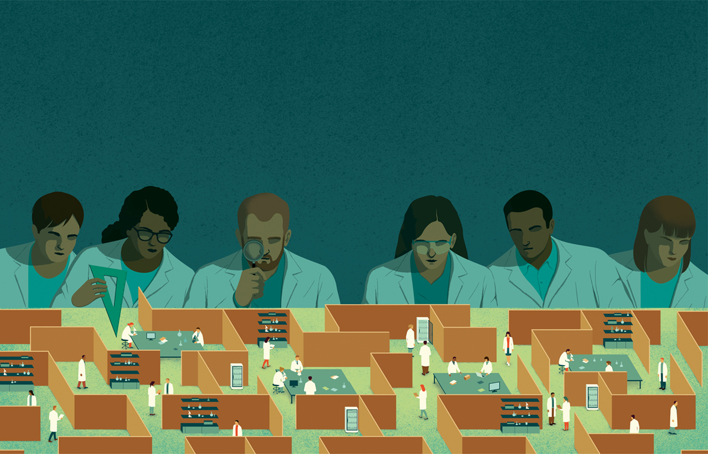
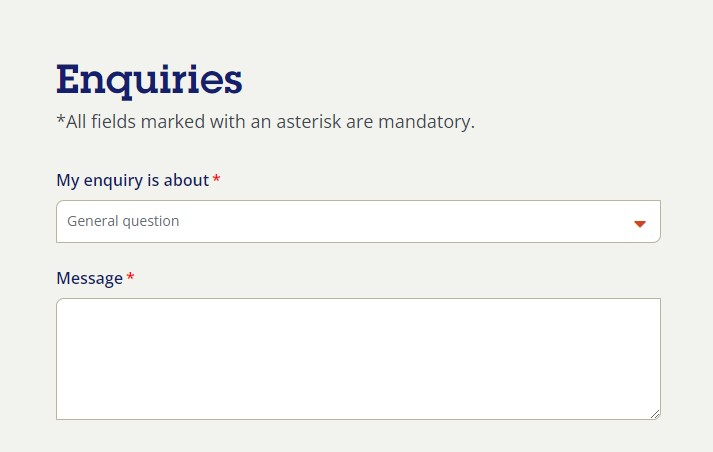
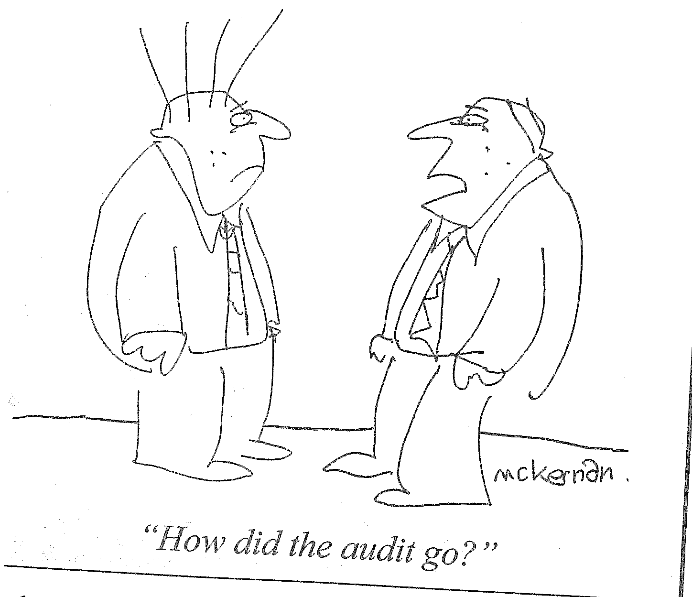

```{r setup, include=FALSE}

# see https://github.com/rstudio-education/arm-workshop-rsc2019/blob/master/static/slides/xaringan.Rmd
knitr::opts_chunk$set(echo = FALSE, warning=FALSE, message=FALSE, error=FALSE, comment='', dpi=400, fig.align='center')
options(htmltools.dir.version = FALSE)
#xaringanExtra::use_xaringan_extra(c("tile_view", "animate_css", "tachyons"))
library(tidyverse)
library(dplyr)
library(ggplot2)
library(knitr)
library(flextable)
library(fontawesome) # from github: https://github.com/rstudio/fontawesome
cbbPalette <- c("#000000", "#E69F00", "#56B4E9", "#009E73", "#F0E442", "#0072B2", "#D55E00", "#CC79A7")
g.theme = theme_bw() + theme(panel.grid.minor = element_blank())
```

layout: true
  
---
name: xaringan-title
class: inverse, left, middle

.pull-left[

# .center[Is requiring Research Integrity Advisors a useful policy for improving research integrity?]

## .center[Adrian Barnett, QUT]

### .center[November 2023]

[`r fa(name = "mastodon")` @aidybarnett](https://fediscience.org/@aidybarnett)  

[`r fa(name = "github")` @agbarnett](http://github.com/agbarnett)  

[`r fa(name = "blog")` Median Watch](https://medianwatch.netlify.app)

[`r fa(name = "paper-plane")` a.barnett@qut.edu.au](mailto:a.barnett@qut.edu.au)

]


.pull-right[



(From David Bonazzi, https://www.davidebonazzi.com/news/science-research-on-research)

]

---
# Declarations

* ## I am not a research integrity advisor

* ## I have given advice to many researchers on serious integrity issues

--

* ## Interest in research integrity advisors arose from discussions with NHMRC staff about effective policies

* ## I am a member of the NHMRC Research Committee and NHMRC Research Quality Committee, the research and opinions here are my own
---

.pull-left[

* ## Advisors have been in place for some time, but with no evidence of their benefits

* ## Aimed to reach every national advisor and ask them about their:
+ ### Workload 
+ ### Perceived benefits
+ ### Ideas for improvements

]

.pull-right[


(from surveysparrow at giphy)

]

---

```{r, out.width='65%'}
knitr::include_graphics(path='figures/consort_flow.jpg')
```


---
# National numbers

```{r, out.width="49%", out.height="20%", fig.cap=" ", fig.show='hold', fig.align='center'}
# side-by-side figures
knitr::include_graphics(c("figures/numbers_bar.jpg","figures/national_numbers.jpg"))
```

Estimated 739 advisors nationally

---
# Disappointing results

.pull-left[

* Multiple institutions where we found it difficult to find anything about research integrity 

* Multiple institutions where the contact about research integrity was a generic e-mail or generic online form

* Institutes that wrongly believed the policy did not apply to them

]

.pull-right[



]

--

```{r, out.width='95%'}
knitr::include_graphics(path='figures/coming_soon.jpg')
```

---
# Too many TLAs

* ## Confusion between Research Integrity Officers, Research Ethics Officers, and Research Integrity Advisors

* ## If Research Integrity Australia (RIA) is created then the acronyms will be OTT

* ## (P.S. Don't use acronyms, see DOI: [10.7554/eLife.60080](https://elifesciences.org/articles/60080))

---
# Falling short

* ## 13% of advisors had not received any training

* ## Some advisors only discovered they were an advisor after our approach; "I’ve never been a research integrity advisor, so am unable to help sorry!''

--

* ## There were some institutions that took the role seriously, including good advertising and monthly meetings of advisors

* ## "Four times a year I get together with my fellow RIAs and we present cases to each other (anonymized) and that is a great learning experience."

---
## Workload: time per month

```{r, out.width='52%'}
knitr::include_graphics(path='figures/advisors_time.jpg')
```

Median of just 0.5 days per month.

---
## Workload: numbers of people helped

```{r, out.width='72%'}
knitr::include_graphics(path='figures/advisors_help_numbers.jpg')
```


---

.left-column[
## Where advice has been provided

]

.right-column[
```{r, out.width='89%'}
knitr::include_graphics(path='figures/advisors_help.jpg')
```
]

---

.left-column[
## Ideas for change

Other:

* National workshops for RIAs
* Better training
* Feedback pathway to senior management
* Visible to new staff/students


]

.right-column[
```{r, out.width='351%'}
knitr::include_graphics(path='figures/advisors_thoughts.jpg')
```
]

---
class:inverse

.pull-left[

* ### To receive NHMRC funds, institutes make a legal commitment that includes identifying and training research integrity advisors

* ### Some institutes are not in compliance

* ### Could not verify if 62 institutions are compliant with the Code

* ### “My experience is that Institutions seem to ‘tick and flick’ research integrity advisors. They are required to have them under The Code, but they often just nominate someone in each school and then forget about them once initial training is provided.”

* ### "Doverey, no proverey'' (Trust, but verify)

]

.pull-right[



]

---
class:inverse,center,middle

.pull-left[

## Is requiring Research Integrity Advisors a useful policy for improving research integrity? 

]

.pull-right[


(from giphy)

]

---
class:inverse
# Study limitations

* ### Short survey, not an in-depth investigation

* ### Missed lots of advisors

* ### Did not get perspective of researchers seeking advice

---
## Potential policy improvements

* ### Greater scrutiny and transparency of institutes

* ### Make names of advisors public

* ### Greater advertising and recognition of advisors and their role

--

* ### Change to integrity champions (Luxembourg Agency for Research Integrity, University of Cambridge Citation, TU Delft)

* ### Add one advisor who is external to the institute (TU Delft)

* ### Should advisors be deans of research?


---
class: inverse
## Australia Institute, November 2023

### Recommendations for creating a world-leading research integrity watchdog with teeth 

### Recommendation 4: Establish a network of research integrity officers (RIOs) based in research institutions but accountable to the independent watchdog

```{r}
# From https://australiainstitute.org.au/post/independent-watchdog-essential-to-combat-research-misconduct/
```

--

### My recommendation: involve current advisors in the design of any new system

---
class:inverse
# Questions and discussion

.pull-left[

Paper: [DOI = 10.1080/08989621.2023.2239532](https://www.tandfonline.com/doi/full/10.1080/08989621.2023.2239532)

Data and code: [https://github.com/agbarnett/integrity_advisors](https://github.com/agbarnett/integrity_advisors)

]

.pull-right[


(from simpsonsworld @ giphy)

]
