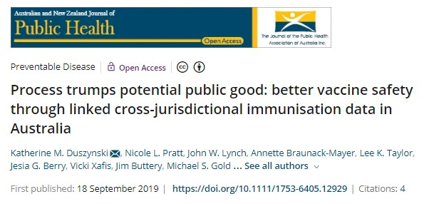
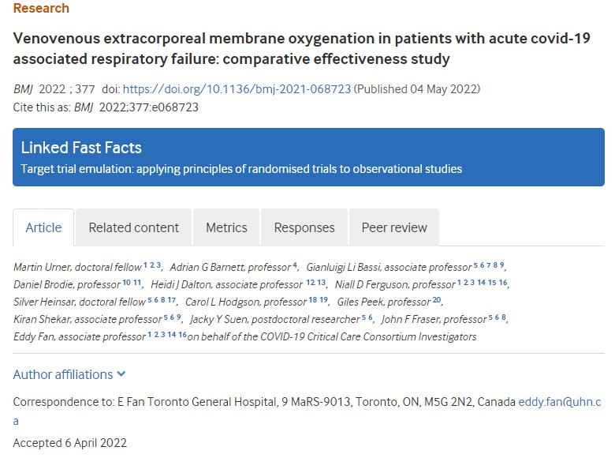
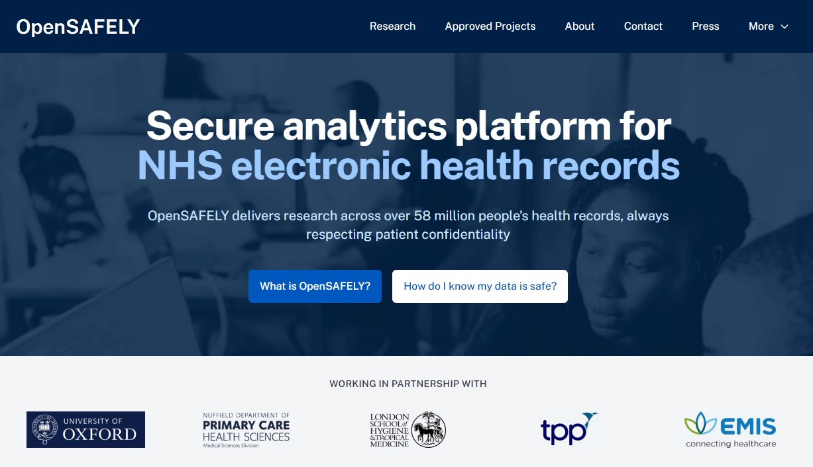

```{r setup, include=FALSE}
# have removed slide number using slideNumberFormat
# see https://github.com/rstudio-education/arm-workshop-rsc2019/blob/master/static/slides/xaringan.Rmd
knitr::opts_chunk$set(echo = FALSE, warning=FALSE, message=FALSE, error=FALSE, comment='', dpi=400, fig.align='center')
options(htmltools.dir.version = FALSE)
#xaringanExtra::use_xaringan_extra(c("tile_view", "animate_css", "tachyons"))
library(tidyverse)
library(dplyr)
library(cowplot) # for side-by-side figures
library(ggplot2)
library(knitr)
library(fontawesome) # from github: https://github.com/rstudio/fontawesome
cbbPalette <- c("#000000", "#E69F00", "#56B4E9", "#009E73", "#F0E442", "#0072B2", "#D55E00", "#CC79A7")
```

layout: true
  
---
name: xaringan-title
class: inverse, left, middle

.pull-left[

# .center[Databases and the risks of managing 45 million data points]

## .center[Adrian Barnett, QUT]

### .center[9 March 2023]

[`r fa(name = "twitter")` @aidybarnett](http://twitter.com/aidybarnett)  

[`r fa(name = "github")` @agbarnett](http://github.com/agbarnett)  

[`r fa(name = "blog")` Median Watch](https://medianwatch.netlify.app)

[`r fa(name = "paper-plane")` a.barnett@qut.edu.au](mailto:a.barnett@qut.edu.au)

]

.pull-right[


(from giphy)

]


---
### Terms of refernece for a UK review

How do we facilitate access to data by researchers while preserving patient privacy?

How do we facilitate access to NHS data by researchers, commissioners, and innovators, while preserving patient privacy?

---
class: center, middle
# Ongoing problems with access to research data in Australia



Took six years to get linked data

---
# Already done it



---
# Done it better in the UK



---
# Getting this in Australia?

Add giphy for uphill task


---
class: center, middle

```{r}
# space slide
```

---
name: xaringan-title
class: inverse, left, middle

.pull-left[

# .center[Beyond dissemination: Why most research is wrong]

## .center[Adrian Barnett, QUT]

### .center[10 March 2023]

[`r fa(name = "twitter")` @aidybarnett](http://twitter.com/aidybarnett)  

[`r fa(name = "github")` @agbarnett](http://github.com/agbarnett)  

[`r fa(name = "blog")` Median Watch](https://medianwatch.netlify.app)

[`r fa(name = "paper-plane")` a.barnett@qut.edu.au](mailto:a.barnett@qut.edu.au)

]

.pull-right[

```{r, out.width='150%'}
knitr::include_graphics(path='figures/nature_cover_statistics.jpg')
```

(Illustration by David Parkins)

]

---

```{r, out.width='63%'}
knitr::include_graphics(path='figures/lancet_paper.jpg')
# DOI:  10.1016/S0140-6736(20)30566-3
```

<!--- * Incorrectly used logistic regression instead of survival analysis --->

* 813 hospitalised, 613 (75%) excluded because they were still hospitalised or not confirmed as infected

--

### Two implications:

* Bad research is not restricted to "low impact" journals

* Has been cited 25,000+ times: Many researchers do not recognise the serious statistical flaw

---

```{r, out.width='69%'}
knitr::include_graphics(path='figures/lancet_impact.jpg')
```

<!--- https://twitter.com/TheLancet/status/1542088311702962177 --->
<!--- Emphasis on publishing in top-tier journals is a huge driver of the reproducibility crisis --->

---

```{r, out.width='52%'}
knitr::include_graphics(path='figures/scrabble.jpg')
```

From [NPR](https://www.npr.org/sections/thetwo-way/2015/07/21/424980378/winner-of-french-scrabble-title-does-not-speak-french)

---
class: inverse

```{r, out.width='44%'}
knitr::include_graphics(path='figures/gauss.jfif')
```

(Image from _Wikipedia_)

---

```{r, out.width='58%'}
knitr::include_graphics(path='figures/gelman_age.png')
```

Hat-tip to [Andrew Gelman](https://statmodeling.stat.columbia.edu/)

---
class:inverse
## The evidence-base is horribly biased

```{r, out.width='60%'}
# from U:\Research\Projects\ihbi\aushsi\aushsi_barnetta\meta.research\text.mining\outside.confidence.intervals\figures\4_plot_z.R
knitr::include_graphics(path='figures/Z_plot.png')
```

Z-values extracted from confidence intervals in _Medline_ between 1976 and 2019

---
## Stop developing new diagnostic or prognostic models

```{r, out.width='47%'}
knitr::include_graphics(path='figures/Wynants.jpg')
```

DOI: [10.1136/bmj.m1328](https://www.bmj.com/content/369/bmj.m1328)

<!--- Stop developing prediction models (hard), talk about standard text in justification, talk about stochastic variability, rule out tests might still be useful, e.g. Troponin. Appreciate that data changes. Most predictive value comes from a few variables.--->

---
class: center, middle


---
class: center, middle

```{r, out.width='98%'}
knitr::include_graphics(path='figures/awful_plot3.jfif')
```

---
class: center, middle

```{r, out.width='88%'}
knitr::include_graphics(path='figures/awful_plot4.jfif')
```

---
class: inverse
# The continuing scandal of bad medical research

.pull-left[

* 1994: Doug Altman wrote about ‘The scandal of poor medical research’

* 2015: Doug: Wish I'd said 'bad'

* 2022: 1013 out of 1659 at high risk of bias. Estimated cost of bad trials was £726 million to £8 billion, DOI: [10.1186/s13063-022-06415-5](https://trialsjournal.biomedcentral.com/articles/10.1186/s13063-022-06415-5)
]

.pull-right[


##### By Oxford Clinical Trials Research Unit

]
