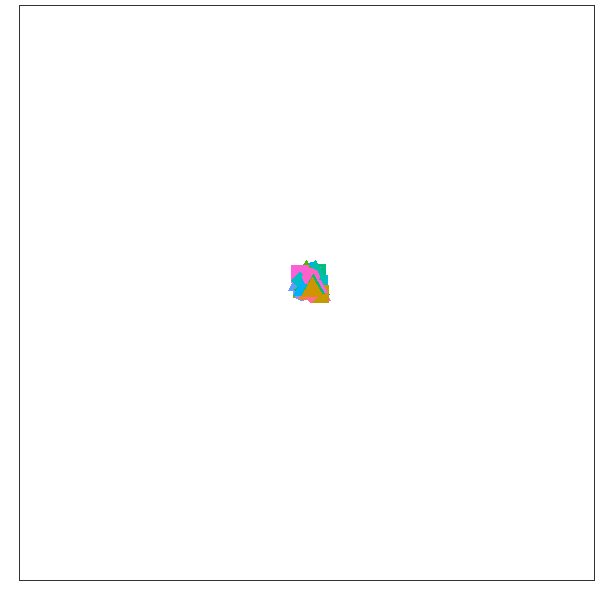

class: inverse
# Appreciate your variance

```{r setup, include=FALSE}
knitr::opts_chunk$set(echo = FALSE, warning=FALSE, message=FALSE, error=FALSE, comment='', dpi=400, fig.align='center')
options(htmltools.dir.version = FALSE)
library(dplyr)
library(ggplot2)
cbbPalette <- c("#000000", "#E69F00", "#56B4E9", "#009E73", "#F0E442", "#0072B2", "#D55E00", "#CC79A7")
```
<!--- see https://github.com/yihui/xaringan/wiki --->

<!--- from make_gganimate.R , also in figures subfolder --->

```{r, out.width='60%'}
 
```

<!--- Not going to get promoted based on box ticking.--->

Although Australia does like box-ticking (see recent _BMJ_ paper on promotions [here](https://www.bmj.com/content/369/bmj.m2081.long))

---
## The review process is a black box

<!--- make gif smaller ---> 


[What is excellence in research?](https://www.nature.com/articles/palcomms2016105)

[What do peer reviewers want?](https://link.springer.com/article/10.1186/s41073-017-0043-x)

* "I think that the proposals that rank the highest ... they’re stretching the boundaries of where we are in the research at the time.''

* "All grant writing is selling and I'm not interested in how clever you are or how intellectual you can be; I just want good, solid, doable research which is going to make a difference.''

<!--- have to see the process live to understand it --->

---
## Writing is a balancing act


* Tread the line of novelty and feasibility

---
class: inverse
## Expect failures #1 

Some of my failed ARC/NHMRC applications:

* Advancing statistical models of the effects of air pollution and temperature on health (rejected 2008)

* Developing an effective early warning system for heat waves (rejected 2010)

* Temperature, mortality and morbidity in Australia (rejected 2012)

* The health costs of climate change for Australia (rejected 2013)

<!--- didn't convince people this was an issue --->
<!--- the system is reactionary --->


---
### Expect failures #2 

* In 2015 I had 7 failed fellowship applications and 0 successes

<!--- from https://github.com/agbarnett/quit.research --->

```{r, out.width='55%'}
 
```


* 23% posterior probability of being in the top half

* Need 12 failures to have a more than 90% probability of being in the bottom half

* Full blog [here](https://medianwatch.netlify.app/post/quit-research/)

<!--- little signal in failure --->
<!--- develop thick skin --->

---
class: inverse
## Chance

* Understand and acknowledge the role of luck in your career

* Don't be too downhearted if your grant gets rejected

* Don't over-interpret reviewers' comments


* Failure could simply be luck of the draw

* Don't get carried away with success

---
## Collect data

* Keep a prospective list of everything you do. Include consulting, teaching, examining, presentations, committees, etc.


---
class: inverse
## Few other thoughts 

* Not all about papers and books. Think about apps, software packages, videos, training materials, etc

* Go on a writing course $\ldots$ then go on it again

* One consistent "story" of limited scope may be better than trying to mention all the things you do

* My successful NHMRC application is available [here](https://eprints.qut.edu.au/98764/1/APP1117784_Barnett_Grant_Proposal.pdf)

