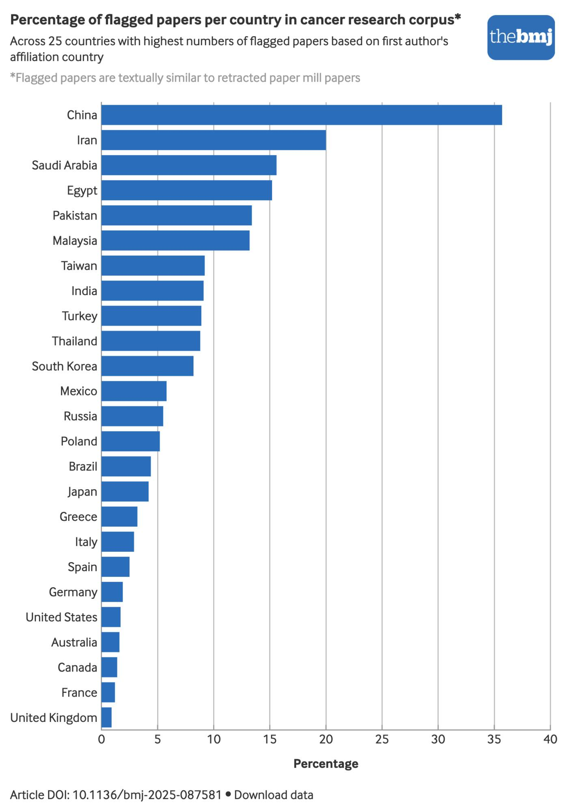
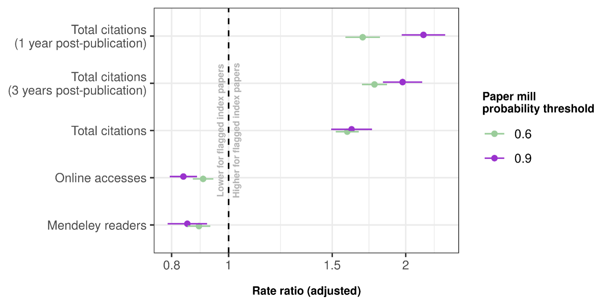

## <xx-small style="color:transparent">Templated papers</xx-small>{background-image='figures/baptiste_slide1.jpg' background-opacity=1 background-size='cover'}

## <xx-small style="color:transparent">Retraction watch</xx-small>{background-image='figures/baptiste_slide2.jpg' background-opacity=1 background-size='cover'}

## <xx-small style="color:transparent">Templated papers</xx-small>{background-image='figures/baptiste_slide3.jpg' background-opacity=1 background-size='cover'}

## Paper mills are growing{background-color='white'}

{width=640px}

## <xx-small style="color:transparent">Where</xx-small>{background-color='white'}

:::: columns
::: {.column width="40%"}
<Large>Country incentives are important</Large>
:::
  
::: {.column width="62%"}
{.absolute top="10"
right="20"}
:::
::::

## High citations, low engagement{background-color='white'}

::::aside

DOI [10.64898/2026.05.25.727627](https://www.biorxiv.org/content/10.64898/2026.05.25.727627v1)

::::

## Limitations

* Our language model is specific to pre-clinical cancer papers.

* Other fields and study designs would need new models --- needs to be a good number of retractions to train the model

* Our model was built before the explosion of LLM-written papers which do not use a template and will be much harder to detect

## Data and paper mining{background-color='white'}

{width=630px}

::::aside

DOI: [10.1016/j.jclinepi.2026.112203](https://www.sciencedirect.com/science/article/pii/S0895435626000788)

::::

## Data too open?{background-image='figures/muhammad-zaqy-al-fattah-Lexcm-6FHRU-unsplash.jpg' background-opacity=0.4 background-size='cover'}

* With Matt Spick (Uni of Surrey), we created a paper using _Prism_ (_OpenAI_) in 30 minutes with no human input

::::aside
[LSE Impact](https://blogs.lse.ac.uk/impactofsocialsciences/2026/03/17/research-integrity-is-locked-into-an-arms-race-with-agentic-ai-slop/); Photo by <a href="https://unsplash.com/@dizzydizz?utm_source=unsplash&utm_medium=referral&utm_content=creditCopyText">Muhammad Zaqy Al Fattah</a> on <a href="https://unsplash.com/photos/silver-padlock-Lexcm-6FHRU?utm_source=unsplash&utm_medium=referral&utm_content=creditCopyText">Unsplash</a>
      
::::

## Data too open?{visibility='uncounted' background-image='figures/muhammad-zaqy-al-fattah-Lexcm-6FHRU-unsplash.jpg' background-opacity=0.4 background-size='cover'}

* With Matt Spick (Uni of Surrey), we created a paper using _Prism_ (_OpenAI_) in 30 minutes with no human input

* _Paper Orchestra_ (_Google_), produces a submission-ready manuscript with figures and verified citations in about 40 minutes

<!--- https://yiwen-song.github.io/paper_orchestra/ --->

::::aside
[LSE Impact](https://blogs.lse.ac.uk/impactofsocialsciences/2026/03/17/research-integrity-is-locked-into-an-arms-race-with-agentic-ai-slop/); Photo by <a href="https://unsplash.com/@dizzydizz?utm_source=unsplash&utm_medium=referral&utm_content=creditCopyText">Muhammad Zaqy Al Fattah</a> on <a href="https://unsplash.com/photos/silver-padlock-Lexcm-6FHRU?utm_source=unsplash&utm_medium=referral&utm_content=creditCopyText">Unsplash</a>
::::

## Data slop{background-color='white'}

:::: columns
::: {.column width="50%"}

"A smart camera located in patient rooms has been used to collect images"

{width=400}

:::
::: {.column width="50%"}

:::
::::
  
::::aside

DOI:[10.1038/s41598-025-28513-5](https://www.nature.com/articles/s41598-025-28513-5) 

::::

## Data slop{background-color='white' visibility="uncounted"}

:::: columns
::: {.column width="50%"}

"A smart camera located in patient rooms has been used to collect images"

{width=400}

:::
::: {.column width="50%"}

"An authoritative dataset was used as the research object"

{width=400}

:::
::::
  
::::aside

DOI:[10.1038/s41598-025-28513-5](https://www.nature.com/articles/s41598-025-28513-5) & DOI:[10.1038/d41586-026-00697-4](https://www.nature.com/articles/d41586-026-00697-4)

::::

# Solutions?{background-color='#d5c3a3'}

::::aside
from giphy
::::

## Some other techniques{background-image='figures/alina-grubnyak-ZiQkhI7417A-unsplash.jpg' background-opacity=0.4 background-size='cover'}

* Unusual author networks (Leslie McIntosh)

* Fast submissions, duplicate submissions

* INSPECT-SR tool (from Jack Wilkinson and colleagues); potential to automate

::::aside
Photo by <a href="https://unsplash.com/@alinnnaaaa?utm_source=unsplash&utm_medium=referral&utm_content=creditCopyText">Alina Grubnyak</a> on <a href="https://unsplash.com/photos/low-angle-photography-of-metal-structure-ZiQkhI7417A?utm_source=unsplash&utm_medium=referral&utm_content=creditCopyText">Unsplash</a>
::::

## Leave paper trails{background-color='white'}

:::: aside

from BoxMedia on giphy

::::

## Money for quality control{background-image='figures/adam-nir-wTO6MWpMrJk-unsplash.jpg' background-opacity=0.2 background-size='cover'}

* The _American Society for Quality_ states that organisations typically spend 10 to 15% of their operating costs on quality-related costs 

* For the NHMRC budget only, this would mean $740 million per year on quality-related work

* Actual spending is around $1 million

::::aside
Photo by <a href="https://unsplash.com/@adamnir?utm_source=unsplash&utm_medium=referral&utm_content=creditCopyText">Adam Nir</a> on <a href="https://unsplash.com/photos/a-close-up-of-a-one-dollar-bill-wTO6MWpMrJk?utm_source=unsplash&utm_medium=referral&utm_content=creditCopyText">Unsplash</a>
::::

## Money for quality control{visibility="uncounted" background-image='figures/adam-nir-wTO6MWpMrJk-unsplash.jpg' background-opacity=0.2 background-size='cover'}

* The _American Society for Quality_ states that organisations typically spend 10 to 15% of their operating costs on quality-related costs 

* For the NHMRC budget only, this would mean $740 million per year on quality-related work

* Actual spending is around $1 million

* Publishers cry poor, but last year the mega-publisher _Elsevier_ made GBP £1.2 billion in profit

::::aside
Photo by <a href="https://unsplash.com/@adamnir?utm_source=unsplash&utm_medium=referral&utm_content=creditCopyText">Adam Nir</a> on <a href="https://unsplash.com/photos/a-close-up-of-a-one-dollar-bill-wTO6MWpMrJk?utm_source=unsplash&utm_medium=referral&utm_content=creditCopyText">Unsplash</a>
::::

