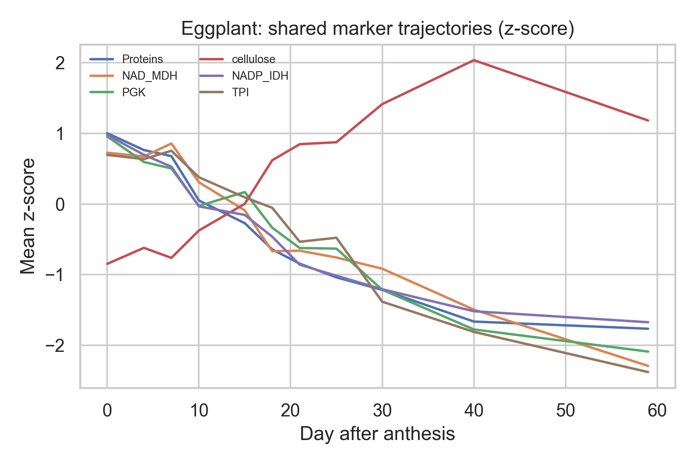

## <small style="color:transparent">Robots</small>{background-colour='#6596d1' background-image='figures/stop_hiring_humans.jpg'}

## Should AI steal your job?

## 30 minute paper{background-color='white'}

::::aside
[Octopus](https://www.octopus.ac/publications/za6p-4457/versions/latest)
::::

## Data slop{background-color='white'}

:::: columns
::: {.column width="50%"}

"A smart camera located in patient rooms has been used to collect images"

{width=400}

:::
::: {.column width="50%"}

:::
::::
  
::::aside

DOI:[10.1038/s41598-025-28513-5](https://www.nature.com/articles/s41598-025-28513-5) 

::::

## Data slop{background-color='white' visibility="uncounted"}

:::: columns
::: {.column width="50%"}

"A smart camera located in patient rooms has been used to collect images"

{width=400}

:::
::: {.column width="50%"}

"An authoritative dataset was used as the research object"

{width=400}

:::
::::
  
::::aside

DOI:[10.1038/s41598-025-28513-5](https://www.nature.com/articles/s41598-025-28513-5) & DOI:[10.1038/d41586-026-00697-4](https://www.nature.com/articles/d41586-026-00697-4)

::::
