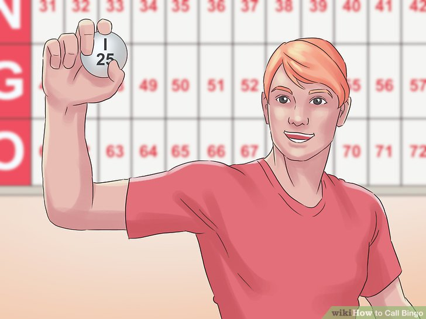

```{r setup, include=FALSE}
# see https://github.com/rstudio-education/arm-workshop-rsc2019/blob/master/static/slides/xaringan.Rmd
knitr::opts_chunk$set(echo = FALSE, warning=FALSE, message=FALSE, error=FALSE, comment='', dpi=400, fig.align='center')
options(htmltools.dir.version = FALSE)
#xaringanExtra::use_xaringan_extra(c("tile_view", "animate_css", "tachyons"))
library(tidyverse)
library(dplyr)
library(cowplot) # for side-by-side figures
library(ggplot2)
library(knitr)
library(fontawesome) # from github: https://github.com/rstudio/fontawesome
cbbPalette <- c("#000000", "#E69F00", "#56B4E9", "#009E73", "#F0E442", "#0072B2", "#D55E00", "#CC79A7")
```

layout: true
  
---
name: xaringan-title
class: inverse, left, middle

.pull-left[

# .center[Using lotteries to award research funding]

## .center[Adrian Barnett, QUT]

### .center[18 November 2022]

[`r fa(name = "twitter")` @aidybarnett](http://twitter.com/aidybarnett)  

[`r fa(name = "github")` @agbarnett](http://github.com/agbarnett)  

[`r fa(name = "blog")` Median Watch](https://medianwatch.netlify.app)

[`r fa(name = "paper-plane")` a.barnett@qut.edu.au](mailto:a.barnett@qut.edu.au)

]


.pull-right[


]

---
# My background

.pull-left[

* Professor of statistics
* Ran experiments on funding:
  + Uncertainty in scoring and decisions
  + Time needed to complete applications
  + Stress on applicants
  + Using a lottery
  
]

.pull-right[

<!--- Once worked in a bingo hall ; https://www.wikihow.com/Call-Bingo--->



###### Image from _wikiHow_

]

---
class: center, middle
# What is your favourite shade of blue?

```{r, out.width='58%'}
# from Make_blues.R
knitr::include_graphics(path='figures/blues.jpg')
```

---
class: center, middle
# Who most deserves funding?

```{r, out.width='40%'}
knitr::include_graphics(path='figures/four_scientists.jpg')
```

##### Images from _Wikipedia_

---
# Reviewers can be biased

```{r}
# Create simple plot for editing with photos in photoshop
data = data.frame(who = 1:3, reject=c(23, 48, 65))
gplot = ggplot(data=data, aes(x=who, y=reject))+
  geom_line(col = 'dodgerblue', size=1.05)+
  geom_point(col = 'dodgerblue', size=4)+
  scale_x_continuous(breaks=1:3, labels=c("Nobel",'Anonymous','Little known'))+
  scale_y_continuous(limits=c(0,NA))+
  xlab('')+
  ylab('Percent rejected')+
  theme_bw()+
  theme(panel.grid.minor = element_blank(),
        plot.margin = margin(0.1, 0.5, 2.8, 0.1, "cm")) # t, r, b, l
jpeg('figures/nobel.jpg', width=5, height=4, units='in', res=500, quality=100)
print(gplot)
invisible(dev.off())
# include edited version
knitr::include_graphics(path='figures/nobel_edited.jpg')
```

###### [Huber et al](https://papers.ssrn.com/sol3/papers.cfm?abstract_id=4190976)

---
# Noise in peer review

```{r, out.width='50%'}
# from gallo.R
knitr::include_graphics(path='figures/gallo.jpg')
```

###### [Gallo et al](https://journals.plos.org/plosone/article?id=10.1371/journal.pone.0165147) _PLOS ONE_ 2016

---
# Noise in peer review #2 

```{r, out.width='70%'}
# from animate_funding.R
knitr::include_graphics(path='figures/barplot.jpg')
```

###### [Graves et al](https://www.bmj.com/content/343/bmj.d4797) _BMJ_ 2011

---
# Science is unpredictable

```{r, out.width='45%'}
knitr::include_graphics(path='figures/elife_edited.jpg')
```

[Fang et al](https://elifesciences.org/articles/13323)

---
# Costs and accuracy

```{r, out.width='45%'}
knitr::include_graphics(path='figures/bmjopen-2013-January-3-5--F2.large.jpg')
```

[Herbert et al](https://bmjopen.bmj.com/content/3/5/e002800)

---
# Externalising costs 

.pull-left[
* 650 applicants and 6 awards; success < 1%

* Total prize = $900,000 ($150,000 per winner)

* Prize would be wiped out if each applicant spent 7 days on their application 

[Blog post](https://medianwatch.netlify.app/post/hidden_funding_costs)
]

.pull-right[

```{r, out.width='57%'}
knitr::include_graphics(path='https://media.giphy.com/media/5rW0M5Hmm28cE/giphy.gif')
```


###### (from giphy.com)

]

---
class: inverse
# A modified lottery

### 1. Applicants are reviewed to ensure they fit the goals of the scheme

--

### 2. Eligible applicants awarded at random until funding runs out


---
class: middle, inverse
# Lottery examples from ancient and recent history

```{r}
knitr::include_graphics(path='figures/lottery_examples.jpg')
```

---
class: middle
# International funders using modified lotteries

```{r, out.width='150%'}
knitr::include_graphics(path='figures/agencies.jpg')
```


---
class: middle
# Societies using modified lotteries

```{r, out.width='100%'}
knitr::include_graphics(path='figures/societies.jpg')
```


---
# What did applicants say?

.pull-left[

```{r, out.width='100%'}
knitr::include_graphics(path='figures/lottery_paper.png')
```

[Lui et al](https://researchintegrityjournal.biomedcentral.com/articles/10.1186/s41073-019-0089-z)

]

.pull-right[

* 63% in favour of using lottery, 25% against

* Provided those applications that made it through the initial stage were “of equal merit”, “deemed worthy enough”

* “I don't think a randomisation process is any less fair than an individual reviewer finding some minor reason for a great project not to be funded.”

]

---
# Arguments against using a modified lottery

.pull-left[

Rewards less deserving and/or less enthusiastic

Encourages less talented to apply

Applicants put in less effort

Still requires peer review

]

.pull-right[


###### (from giphy.com)

]

---
# Potential benefits for scientific societies

.pull-left[

Reduces cronyism (and perception of cronyism)

Increases diversity in winners

Reduces application and review costs

Acknowledges that science is unpredictable

--

Reduces stigma of failure

Might reduce "Matthew effect"

--

Creates a perfect randomised trial of funding

]

.pull-right[


###### (from giphy.com)

]


---
# Alterations

.pull-left[

1. Golden ticket: "outstanding" applications skip the lottery

2. Weighted lotteries: some applicants get more tickets than others

3. Stratified lotteries: e.g., winners at least 50% women

]

.pull-right[

```{r, out.width='60%'}
knitr::include_graphics(path='figures/pexels-tima-miroshnichenko-6714383.jpg')
```


##### Photo by Tima Miroshnichenko

]


---
# Worthwhile data

.pull-left[

### Ask applicants:

### 1. How long they spent on their application

### 2. What system they would prefer 

]

.pull-right[


]


---
class: inverse, center, middle
# Questions?


###### (from giphy.com)
