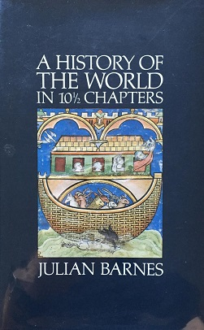
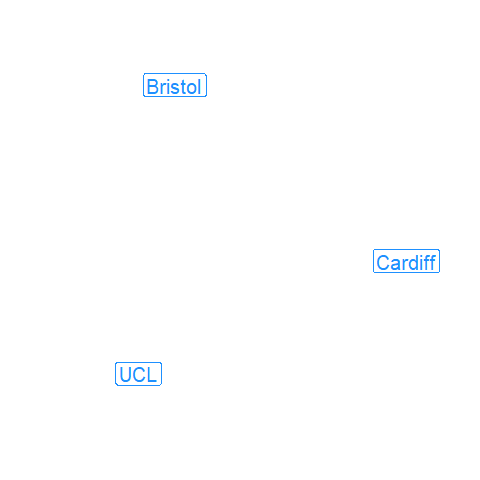

```{r setup, include=FALSE}
# see https://github.com/rstudio-education/arm-workshop-rsc2019/blob/master/static/slides/xaringan.Rmd
knitr::opts_chunk$set(echo = FALSE, warning=FALSE, message=FALSE, error=FALSE, comment='', dpi=400, fig.align='center')
options(htmltools.dir.version = FALSE)
#xaringanExtra::use_xaringan_extra(c("tile_view", "animate_css", "tachyons"))
library(tidyverse)
library(dplyr)
library(ggplot2)
library(knitr)
library(flextable)
library(fontawesome) # from github: https://github.com/rstudio/fontawesome
cbbPalette <- c("#000000", "#E69F00", "#56B4E9", "#009E73", "#F0E442", "#0072B2", "#D55E00", "#CC79A7")
```

layout: true
  
---
name: xaringan-title
class: inverse, left, middle

.pull-left[

# .center[Teflon tables: is there any criticism of university league tables that will stick?]

## .center[Adrian Barnett, QUT]

### .center[23 March 2023]

[`r fa(name = "twitter")` @aidybarnett](http://twitter.com/aidybarnett)  

[`r fa(name = "github")` @agbarnett](http://github.com/agbarnett)  

[`r fa(name = "blog")` Median Watch](https://medianwatch.netlify.app)

[`r fa(name = "paper-plane")` a.barnett@qut.edu.au](mailto:a.barnett@qut.edu.au)

]


.pull-right[


(from giphy)

]

---
background-image: url(figures/AcknowledgementTraditionalOwners.jpg)
background-size: cover


---

```{r, out.width='81%'}
knitr::include_graphics(path='figures/archer.jpg')
```

Photo by <a href="https://unsplash.com/@hiteshchoudhary?utm_source=unsplash&utm_medium=referral&utm_content=creditCopyText">Hitesh Choudhary</a> on <a href="https://unsplash.com/photos/ec6E029hwMo?utm_source=unsplash&utm_medium=referral&utm_content=creditCopyText">Unsplash</a>
  

---
class: inverse
background-image: url(figures/qut_recent.jpg)
background-size: contain

---
class: inverse, center, middle

.pull-left[



(from Wikipedia)

]

---
class: inverse, center, middle

.pull-left[


(from Wikipedia)

]

.pull-right[

<!--- get a verdict --->

# "You were okay.''

]

---
class:inverse
## Truly measuring quality

.pull-left[

Innovation / originality

Economic value

Social value

Knowledge impact

]

.pull-right[


(from giphy)

]

DOI: [10.1371/journal.pone.0195613](https://journals.plos.org/plosone/article?id=10.1371/journal.pone.0195613)

---
class:inverse
## Magic of numbers and equations

```{r, out.width='74%'}
knitr::include_graphics(path='figures/witchcraft.jpg')
```

Photo by <a href="https://unsplash.com/@art_maltsev?utm_source=unsplash&utm_medium=referral&utm_content=creditCopyText">Artem Maltsev</a> on <a href="https://unsplash.com/photos/3n7DdlkMfEg?utm_source=unsplash&utm_medium=referral&utm_content=creditCopyText">Unsplash</a>
  
<!--- https://www.timeshighereducation.com/world-university-rankings/world-university-rankings-2023-methodology#node-comments --->  
  
---

.pull-left[

```{r, out.width='82%'}
knitr::include_graphics(path='figures/freeways.jpg')
```


Photo by <a href="https://unsplash.com/@dnevozhai?utm_source=unsplash&utm_medium=referral&utm_content=creditCopyText">Denys Nevozhai</a> on <a href="https://unsplash.com/s/photos/freeway?utm_source=unsplash&utm_medium=referral&utm_content=creditCopyText">Unsplash</a>

]
  
.pull-right[

#### Field-Weighted Citation Impact (FWCI)

#### Fractional counting of authors

#### Subject-specific rankings

]


---

.pull-left[


```{r, out.width='82%'}
knitr::include_graphics(path='figures/freeways_with_trees.jpg')
```

Tree from a Photo by <a href="https://unsplash.com/@jeroendenotter?utm_source=unsplash&utm_medium=referral&utm_content=creditCopyText">Jeroen den Otter</a> on <a href="https://unsplash.com/images/nature/tree?utm_source=unsplash&utm_medium=referral&utm_content=creditCopyText">Unsplash</a>

]

.pull-right[

#### Field-Weighted Citation Impact (FWCI)

#### Fractional counting of authors

#### Subject-specific rankings

]
  

---
# Uncertainty

```{r}
knitr::include_graphics(path='figures/citations.jpg')
```

<!--- plus/minus 10% in citations --->

Data from Leiden University ranking

DOI: [10.1111/1740-9713.01663](https://rss.onlinelibrary.wiley.com/doi/full/10.1111/1740-9713.01663)


---
# Missing affiliations

```{r}
table = read.table(header=TRUE, fill=TRUE, sep='\t', text='
University	Score	Cluster	good	Standard
University of Toronto	82.8	5	1 (1 to 2)	2
University of Sydney	75.8	5	2 (1 to 2)	5
Missing	47.3	4	4 (3 to 12)	–
King’s College London	46.5	4	4 (3 to 10)	16
Zhejiang University	42.0	4	7 (3 to 19)	176
') %>%
  rename('Standard rank' = 'Standard',
         'Good practice rank (95% CI)' = 'good')
flextable(table) %>%
  theme_box() %>%
  fontsize(size = 18, part = "all") %>%
  autofit() %>%
  align(j=2:5, align = "center") 
```

DOI: [10.12688/f1000research.18453.2](https://f1000research.com/articles/8-583/v2)

---
class:inverse
# Science is not sport

```{r, out.width='89%'}
knitr::include_graphics(path='figures/football_and_table.jpg')
```

Photo by <a href="https://unsplash.com/@jeffreyflin?utm_source=unsplash&utm_medium=referral&utm_content=creditCopyText">Jeffrey F Lin</a> on <a href="https://unsplash.com/photos/D4DBJk5UmFo?utm_source=unsplash&utm_medium=referral&utm_content=creditCopyText">Unsplash</a>
  
  
---
background-image: url(figures/australia_university_logo.jpg)
background-size: contain

<!--- reduce stupid competition and bureaucracy --->
<!--- Create one mega-university, the university of australia, university of wales college ... --->

---
## Shifting the level of selection in Science

```{r, out.width='63%'}
knitr::include_graphics(path='figures/shifting_teams.jpg')
```

DOI: [10.31222/osf.io/juwck](https://osf.io/preprints/metaarxiv/juwck)

---
## Legal concerns

```{r}
table = read.table(header=TRUE, fill=TRUE, sep='\t', text='
metric	Columbia	Prof
Undergraduate classes with under 20 students	82.5%	62.7% to 66.9%
Full-time faculty with Ph.D or terminal degree	100%	96%
Percent faculty that is full time	96.5%	74.1%
Student-faculty ratio	6 to 1	11 to 1
Financial resources per student	$3.1 billion	$289 million
Six-year graduation percentage	96%	92%') %>%
  rename('League table metric' = 'metric',
         'Prof Thaddeus` estimate' = 'Prof')
flextable(table) %>%
  theme_box() %>%
  fontsize(size = 18, part = "all") %>%
  autofit() %>%
  align(j=2:3, align = "center") 
```


[Prof Michael Thaddeus](http://www.math.columbia.edu/~thaddeus/ranking/investigation.html)

---


```{r, out.width='77%'}
knitr::include_graphics(path='figures/law_schools.jpg')
```

[The Guardian](https://www.theguardian.com/us-news/2022/nov/17/yale-harvard-law-school-us-news-world-report-rankings)

---
class: center, middle, inverse
# Discriminatory

```{r, out.width='75%'}
knitr::include_graphics(path='figures/global_south.jpg')
```

[https://drive.google.com/file/d/11WQ1lxR7oVPJ8OEANpGJ3NLVVqtJcFaj/view](Report)


---
class: inverse
background-image: url(figures/jelena.jpg)
background-size: contain

---
class: center, middle
# Humour

```{r, out.width='115%'}
knitr::include_graphics(path='figures/tweet_work_free_comments.jpg')
```

[tweet](https://twitter.com/aidybarnett/status/1458297944692572160)


---
class: middle, center
# Randomised experiment



---
background-image: url(figures/rank.jpg)
background-size: contain


---
class: inverse
background-image: url(figures/spike_jones.jpg)
background-size: contain

---
class: inverse
background-image: url(figures/spike_jones_edit.jpg)
background-size: contain

---
class: inverse
background-image: url(figures/aimos_conference_slide.jpg)
background-size: contain

