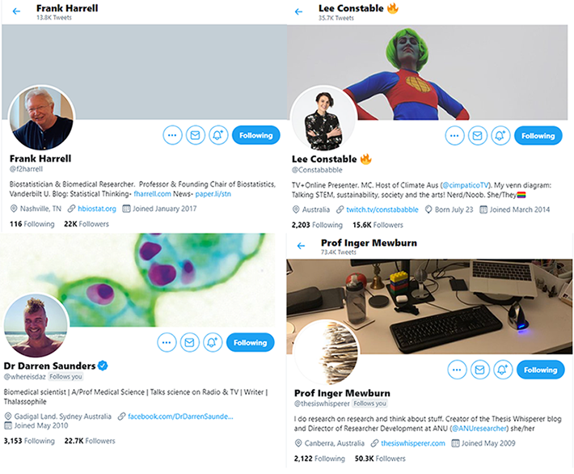
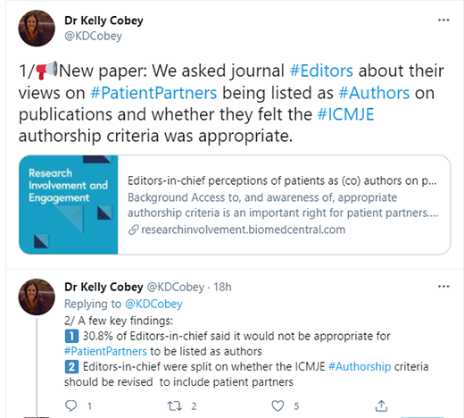
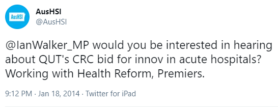
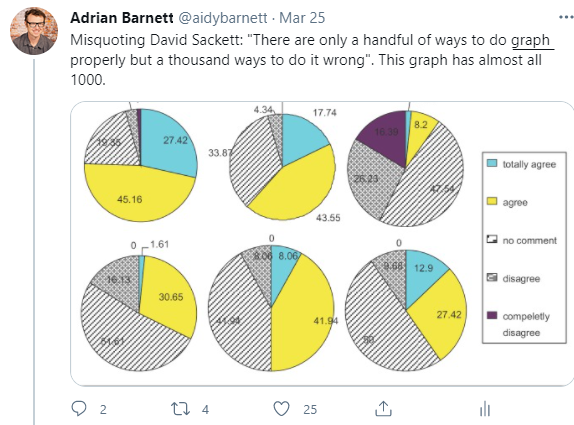
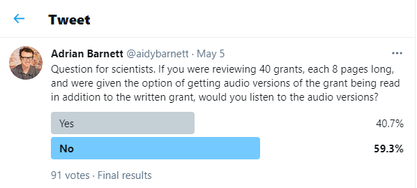
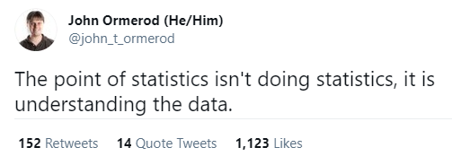
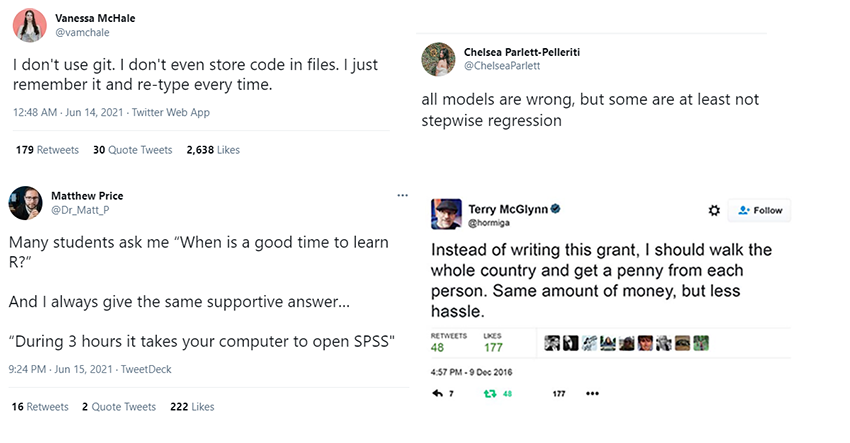

```{r setup, include=FALSE}
# see https://github.com/rstudio-education/arm-workshop-rsc2019/blob/master/static/slides/xaringan.Rmd
knitr::opts_chunk$set(echo = FALSE, warning=FALSE, message=FALSE, error=FALSE, comment='', dpi=400, fig.align='center')
options(htmltools.dir.version = FALSE)
#xaringanExtra::use_xaringan_extra(c("tile_view", "animate_css", "tachyons"))
library(tidyverse)
library(dplyr)
library(ggplot2)
library(knitr)
library(fontawesome) # from github: https://github.com/rstudio/fontawesome
cbbPalette <- c("#000000", "#E69F00", "#56B4E9", "#009E73", "#F0E442", "#0072B2", "#D55E00", "#CC79A7")
```

layout: true
  
---
name: xaringan-title
class: inverse, left, middle

# .center[The effective use of social media to communicate and promote research]

## .center[Adrian Barnett, Queensland University of Technology]

### .center[25 June 2021]

[`r fa(name = "twitter")` @aidybarnett](http://twitter.com/aidybarnett)  

[`r fa(name = "github")` @agbarnett](http://github.com/agbarnett)  

[`r fa(name = "blog")` Median Watch](https://medianwatch.netlify.app)

[`r fa(name = "paper-plane")` a.barnett@qut.edu.au](mailto:a.barnett@qut.edu.au)

---
background-image: url(figures/AcknowledgementTraditionalOwners.jpg)
background-size: cover

<!--- "to speak on the effective use of social media to communicate and promote research" --->
<!--- 20 mins session, leave 5 mins for questions --->

---
class: center
.left-column[
## Some academics and scientists I like on Twitter
]

.right-column[

]

---
class: center
## Promoting work

<!--- https://twitter.com/KDCobey/status/1404476244272500740) --->



---
class: center
### Engaging with people



#### Led to a meeting with the chief policy advisor and the Queensland chief scientist

---
class: center
## Punching down



---
class: center
## Polls




---
class:inverse, center
##	Be authentic
<!--- would be nice to show change in follower numbers --->



---
class: center
##	Be funny



---
class:inverse
# Don'ts

### "OMG! Someone eejit fell asleep during my talk" 

### "Just been in the most boring meeting of my life"

<!--- Best to do it at least a week or two later --->

---
class: center, inverse
background-image: url("figures/median_watch.png")
background-position: center
background-size: contain

---
class: center, inverse
background-image: url("figures/random_sample.png")
background-position: center
background-size: contain


---
class: center

