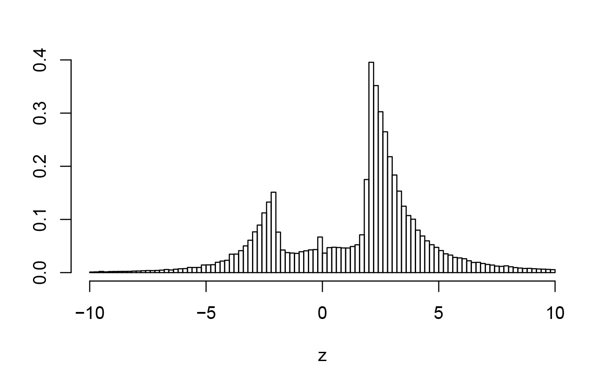
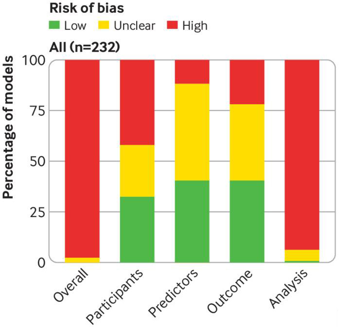
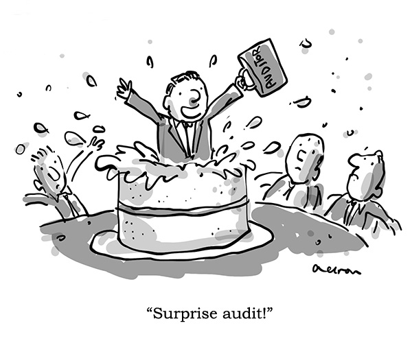

```{r setup, include=FALSE}
# see https://github.com/rstudio-education/arm-workshop-rsc2019/blob/master/static/slides/xaringan.Rmd
knitr::opts_chunk$set(echo = FALSE, warning=FALSE, message=FALSE, error=FALSE, comment='', dpi=400, fig.align='center')
options(htmltools.dir.version = FALSE)
#xaringanExtra::use_xaringan_extra(c("tile_view", "animate_css", "tachyons"))
library(tidyverse)
library(dplyr)
library(ggplot2)
library(knitr)
library(fontawesome) # from github: https://github.com/rstudio/fontawesome
cbbPalette <- c("#000000", "#E69F00", "#56B4E9", "#009E73", "#F0E442", "#0072B2", "#D55E00", "#CC79A7")
```

layout: true
  
---
name: xaringan-title
class: inverse, left, middle

# .center[Statisticians and the reproducibility crisis]

## .center[Queensland Branch Meeting, Statistical Society of Australia]

### .center[Adrian Barnett, Queensland University of Technology]

#### .center[28 September 2021]

[`r fa(name = "twitter")` @aidybarnett](http://twitter.com/aidybarnett)  

[`r fa(name = "github")` @agbarnett](http://github.com/agbarnett)  

[`r fa(name = "blog")` Median Watch](https://medianwatch.netlify.app)

[`r fa(name = "paper-plane")` a.barnett@qut.edu.au](mailto:a.barnett@qut.edu.au)


---
class: center
## The current state of research in one graph

```{r, out.width= '82%'}

```

---
class:inverse, center
## Research-shaped objects

```{r, out.width= '100%'}

```

---
class:inverse, center
## Blurry research-shaped objects

```{r, out.width= '100%'}

```

---
## Review of COVID-19 prediction models

```{r, echo=FALSE, out.width="48%"}

```

Wynants et al, _BMJ_ 2020; 369 doi: https://doi.org/10.1136/bmj.m1328 

---
class: top, center, inverse
background-image: url(figures/podium.jpg)
background-size: cover
### .left[Worst ever statistical methods section]

--

## .left[t-test]

--

## .right[SPSS]


<!--- http://www.anzctr.org.au/Trial/Registration/TrialReview.aspx?ACTRN=12617001415392 --->

--

## .center[SSPS]

<!--- https://www.anzctr.org.au/Trial/Registration/TrialReview.aspx?id=373697 --->


---
class:center, middle
# What can we do?

---
class:center, middle
# Automation


---
# What could we check?

*	Numerical errors

*	P-values and confidence intervals. Checks for inconsistencies and errors, and language used to describe p-values

*	Reproduce sample size calculations. 

*	Checks for mentions of assumptions when using linear and logistic regression models. 

*	Detect missing data in the results that have not been mentioned in the methods 

--

* Potentially fraudulent data, e.g., groups in randomised trials that are too similar

* Outcome switching by comparing the protocol and published paper

* Poorly designed figures

* Flag citations to retracted papers

---
# Random audits

```{r, echo=FALSE, out.width="58%"}

```

###### DOI: 10.1371/journal.pone.0195613


