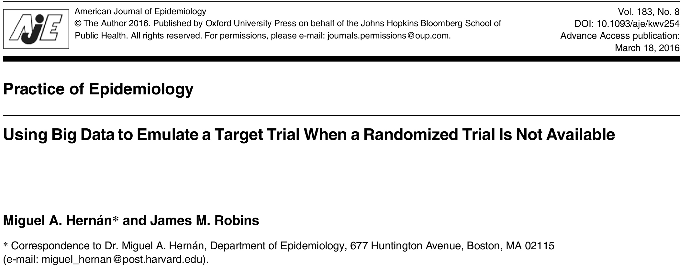
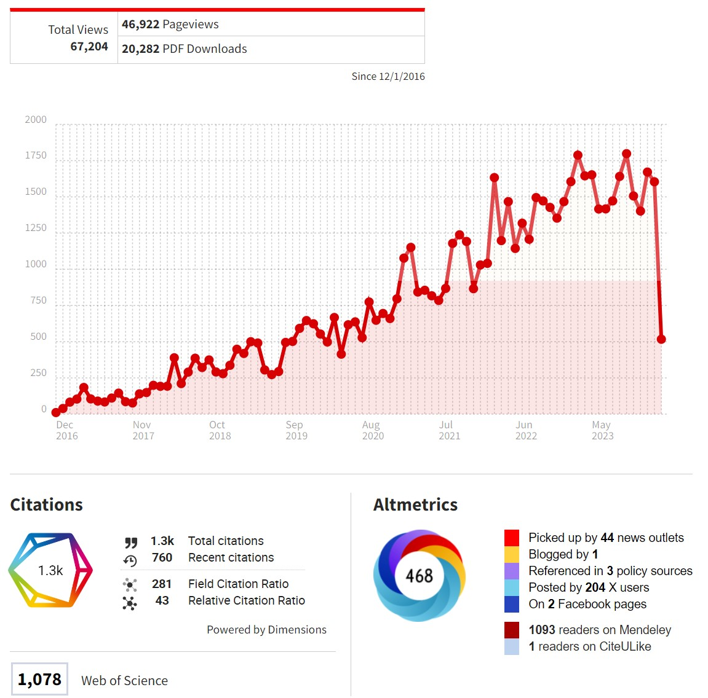

```{r setup, include=FALSE}
## got ? mins ##

# see https://github.com/rstudio-education/arm-workshop-rsc2019/blob/master/static/slides/xaringan.Rmd
knitr::opts_chunk$set(echo = FALSE, warning=FALSE, message=FALSE, error=FALSE, comment='', dpi=400, fig.align='center')
options(htmltools.dir.version = FALSE)
#xaringanExtra::use_xaringan_extra(c("tile_view", "animate_css", "tachyons"))
library(tidyverse)
library(dplyr)
library(ggplot2)
library(knitr)
library(flextable)
library(fontawesome) # from github: https://github.com/rstudio/fontawesome
cbbPalette <- c("#000000", "#E69F00", "#56B4E9", "#009E73", "#F0E442", "#0072B2", "#D55E00", "#CC79A7")
g.theme = theme_bw() + theme(panel.grid.minor = element_blank())
```

layout: true
  
---
name: xaringan-title
class: inverse, left, middle

.pull-left[

# .center[Target trials]

## .center[Adrian Barnett, QUT]

### .center[March 2024]

[`r fa(name = "mastodon")` @aidybarnett](https://fediscience.org/@aidybarnett)  

[`r fa(name = "github")` @agbarnett](http://github.com/agbarnett)  

[`r fa(name = "blog")` Median Watch](https://medianwatch.netlify.app)

[`r fa(name = "paper-plane")` a.barnett@qut.edu.au](mailto:a.barnett@qut.edu.au)

]


.pull-right[


(from giphy)
]


---



---


---

Useful where you cannot randomise

* Antibiotics or antidepressants during pregnancy

* Air pollution ?

* ECMO treatment during the pandemic

<!--- look for other examples --->