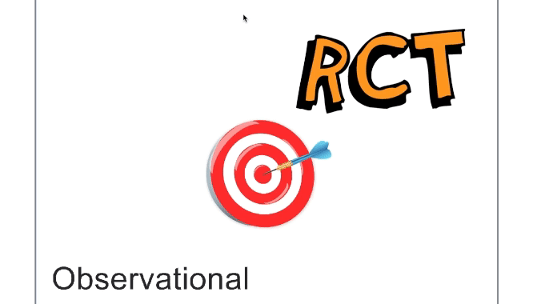

```{r setup, include=FALSE}
## got ? mins ##

# see https://github.com/rstudio-education/arm-workshop-rsc2019/blob/master/static/slides/xaringan.Rmd
knitr::opts_chunk$set(echo = FALSE, warning=FALSE, message=FALSE, error=FALSE, comment='', dpi=400, fig.align='center')
options(htmltools.dir.version = FALSE)
#xaringanExtra::use_xaringan_extra(c("tile_view", "animate_css", "tachyons"))
library(tidyverse)
library(dplyr)
library(ggplot2)
library(knitr)
library(flextable)
library(fontawesome) # from github: https://github.com/rstudio/fontawesome
cbbPalette <- c("#000000", "#E69F00", "#56B4E9", "#009E73", "#F0E442", "#0072B2", "#D55E00", "#CC79A7")
g.theme = theme_bw() + theme(panel.grid.minor = element_blank())
```

layout: true
  
---
name: xaringan-title
class: inverse, left, middle

.pull-left[

# .center[Target trials, a brief introduction]

## .center[Adrian Barnett, QUT]

### .center[April 2024]

[`r fa(name = "mastodon")` @aidybarnett](https://fediscience.org/@aidybarnett)  

[`r fa(name = "github")` @agbarnett](http://github.com/agbarnett)  

[`r fa(name = "blog")` Median Watch](https://medianwatch.netlify.app)

[`r fa(name = "paper-plane")` a.barnett@qut.edu.au](mailto:a.barnett@qut.edu.au)

]


.pull-right[


(from @Refinery29 on giphy)

]


---


---

.left-column[

### Paper's metrics

]

.right-column[
```{r, out.width='78%'}
knitr::include_graphics(path='figures/hernan_robins_metrics.jpg')
```
]

---
class: middle, center




###### target image from [pngtree.com](https://pngtree.com/freepng/hit-the-target_1304919.html)

---
# Useful where you cannot randomise

#### The trial that we would have liked to conduct.

* #### Antibiotics or antidepressants during pregnancy

* #### ECMO treatment for hospitalised patients during the pandemic

* #### (Examples from audience)

--

* #### Cannot regain a blinded trial - more suited to pragmatic trials

* #### Cannot examine placebos - these are not given in practice (?)

---
# Start with a question

.pull-left[

* ### Do statins reduce the risk of colorectal cancer? [PMC7746409](https://www.ncbi.nlm.nih.gov/pmc/articles/PMC7746409/)

* ### Then write a trial protocol

]

.pull-right[


(from @DJTGIF on giphy)

]

---
# Inclusion criteria #1

### Do statins reduce the risk of colorectal cancer?

* ### Age 30 or over
* ### No history of cancer
* ### No statin contraindication
* ### No statin prescription within the past year
* ### LDL cholesterol under 5 mmol/L

---
# Inclusion criteria #2

* ### May have to make modifications as observational data will never be as bespoke as trial data. 

* ### For example:

```{r}
table = read.table(header=TRUE, sep='&', text='
Data&A&T
No history of cancer&Ask patient at baseline visit&No diagnoses in electronic health records
Blood tests&Taken at baseline visit&From nearest available test in electronic health records') %>%
  rename('Actual trial' = 'A',
         'Target trial' = 'T')
ftab = flextable(table) %>%
  theme_box() %>%
  fontsize(size = 18, part = 'all') %>%
  width(j=1, width=2.8) %>%
  width(j=2, width=3) %>%
  width(j=3, width=3.5) 
ftab
```


---
# Exchangeable assumption

.pull-left[

* ### All about randomness

* ### Actual trial: patients could have been in either group (exchangeable)

* ### Target trial: patients are exchangeable at baseline given their covariates

]

.pull-right[


]

---
# Flow chart

```{r, out.width='68%'}
knitr::include_graphics(path='figures/flow.jpg')
```

* ### Not a balanced 1:1 ratio in treatment:control


---
class:inverse
## Time is the enemy 

.pull-left[

* ### Deaths due to other causes (competing risks)

* ### Moved away

* ### Not contactable

* ### All potentially huge sources of bias

* ### Never ever condition on future events

]

.pull-right[

```{r, out.width='68%'}
knitr::include_graphics(path='https://media.giphy.com/media/v1.Y2lkPTc5MGI3NjExZnZyanh3bDUxYzFvZjA2aXkyc3dsZXJ2cmdzdzUzaHEyN3RhbWppNiZlcD12MV9pbnRlcm5hbF9naWZfYnlfaWQmY3Q9Zw/3o7TKJoSDgvrTXcHQc/giphy.gif')
```

(from Thoka Maer on giphy)

]

---
# Intention-to-treat

.pull-left[

* ### How the trial intended to treat people at randomisation

* ### Gives a realistic picture of the treatment in practice

* ### Researchers get this wrong more often than not

]


.pull-right[


(@KatelynTarver on giphy)

]

---
# Per protocol

* ### Gives a more optimistic picture of the treatment

* ### If everyone took the treatment and 'behaved'

* ### Censor individuals if and when they deviate from their assigned treatment strategy

* ### For example, patient 'randomised' to no treatment develops high cholesterol and is given treatment (censor at that point)

* ### Use inverse-probability weights to adjust for pre- and post-baseline prognostic factors associated with treatment adherence and loss to follow-up

---
## Confounders

```{r, out.width='55%'}
knitr::include_graphics(path='figures/DAG2.png')
```

### If the "treatment" is ozone then:

* ### heat is a confounder (heat occurs first)

* ### baby gender is not a confounder


---
# Results 

### Do statins reduce the risk of colorectal cancer?

```{r}
tab = read.table(header = TRUE, sep='&', text = '
Study&OR&X
Target trial (Intention to treat)&1.00&0.87 to 1.16
Target trial (Per protocol)&0.90&0.71 to 1.12
Case control study&0.53&0.38 to 0.74') %>%
  rename('95% CI' = 'X',
         'Odds ratio' = 'OR')
ftab = flextable(tab) %>%
  theme_box() %>%
  autofit() %>%
  width(j=1, width=2.8) %>%
  width(j=2, width=2.2) %>%
  width(j=3, width=2.7) %>%
  align(j=2:3, align='center', part='all') %>%
  fontsize(size = 19, part='all')
ftab
```
* ### The case-control study showed a strong (implausible) benefit to statins

---
class:inverse
# Recommendations


.pull-left[
* ### If you can do a parallel randomised trial then do

* ### ALWAYS write a protocol

* ### ALWAYS work carefully and slowly

* ### Getting high-quality health observational data in Australia is often very challenging

]

.pull-right[


(from @abitan on giphy)

]
