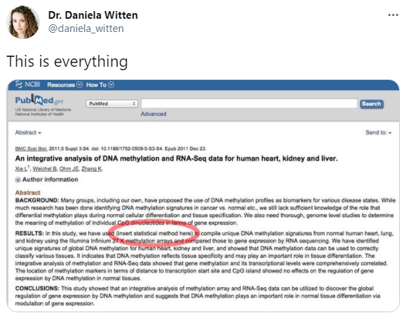

```{r setup, include=FALSE}
# see https://github.com/rstudio-education/arm-workshop-rsc2019/blob/master/static/slides/xaringan.Rmd
knitr::opts_chunk$set(echo = FALSE, warning=FALSE, message=FALSE, error=FALSE, comment='', dpi=400, fig.align='center')
options(htmltools.dir.version = FALSE)
#xaringanExtra::use_xaringan_extra(c("tile_view", "animate_css", "tachyons"))
library(tidyverse)
library(dplyr)
library(ggplot2)
library(knitr)
library(flextable)
library(fontawesome) # from github: https://github.com/rstudio/fontawesome
cbbPalette <- c("#000000", "#E69F00", "#56B4E9", "#009E73", "#F0E442", "#0072B2", "#D55E00", "#CC79A7")
```

layout: true
  
---
name: xaringan-title
class: inverse, left, middle

.pull-left[

# .center[Making robot statistical reviewers]

## .center[Adrian Barnett, QUT]

### .center[23 June 2022]

[`r fa(name = "twitter")` @aidybarnett](http://twitter.com/aidybarnett)  

[`r fa(name = "github")` @agbarnett](http://github.com/agbarnett)  

[`r fa(name = "blog")` Median Watch](https://medianwatch.netlify.app)

[`r fa(name = "paper-plane")` a.barnett@qut.edu.au](mailto:a.barnett@qut.edu.au)

]


.pull-right[


]

---
## Some self-awareness: Every group wants more money

<!--- https://www.aph.gov.au/Parliamentary_Business/Committees/Senate/Community_Affairs/Future_Fund/Submissions --->

*Submissions to the government inquiry into the Medical Research Future Fund:*

**Alzheimer's Australia**: "Public investment in dementia research [needs] to be doubled to at least $60 million per annum"

<!---Bionics Institute: "A more secure funding stream from the MRFF would allow researchers to spend more time on actually conducting R&D and for support staff to plan for the longer-term."--->

<!--- **Children's Cancer Institute**: "One of the most challenging aspects of our work is the lack of funding to drive innovation" --->

**Cure Brain Cancer Foundation**: "Funding preferentially allocated to health priorities based on unmet medical needs such as brain cancer"

--

**Adrian Barnett (statistician)**: We need more statisticians.

---
class: center, middle
# Football referees analogy


(from giphy)

<!--- shortage, ongoing problem, underpaid, underappreciated, but central for the game --->

---
class:inverse
# Statistics is not big enough

### Royal college of Australian Surgeons

* 7,000 surgeons and 1,300 surgical trainees

* Fees of $3,000 per year plus $5,000 per year for fellows

--

### Statistical Society of Australia

* 1,000 members

* Fees of $250 per year plus $55 per year for accredited members

--

## Around a 200 fold difference in income

---
# Potential power of professional groups: [Pharmacy guild](https://www.abc.net.au/news/2019-06-20/pharmacy-guild-lobby-wields-great-political-power/11217028)

```{r, out.width='60%'}
knitr::include_graphics(path='figures/pharmacy.png')
```

---
# Analogy number 2: defending yourself in court

```{r, out.width='70%'}
knitr::include_graphics(path='figures/defend_yourself.jpg')
```

Image from wikiHow.

---
# Analogy number 2: defending yourself in court

```{r, out.width='70%'}
knitr::include_graphics(path='figures/defend_yourself2.png')
```

Image from wikiHow.

---
# Reliance on ritualistic analyses 

```{r, out.width='85%'}
knitr::include_graphics(path='figures/ritual_stats.png')
```

[Stark & Saltelli](https://www.significancemagazine.com/science/593-cargo-cult-statistics-and-scientific-crisis)

---
class:inverse
# Same statistical mistakes ad nauseam

```{r, out.width='85%'}
knitr::include_graphics(path='figures/push_back.png')
```

[Andrew Althouse](https://discourse.datamethods.org/t/reference-collection-to-push-back-against-common-statistical-myths/1787)

---
class:center, middle

```{r, out.width='88%'}
knitr::include_graphics(path='figures/screw_meme.png')
```

---
## Cut-and-paste statistical methods

.pull-left[


(from giphy)

]

.pull-right[

Statistical methods sections:

* 17% using just 50 words or fewer
* 12,675 papers (11%) closely matched to the sentence “a p-value < 0.05 was considered statistically significant”
* Some sections just said "t-test" or "SPSS"

[White et al](https://journals.plos.org/plosone/article?id=10.1371/journal.pone.0264360) DOI: 10.1371/journal.pone.0264360

]

---
class: top, center, inverse

```{r, out.width= '61%'}

```


---
class:inverse
## Shortage of statistical reviewers

<!--- from https://journals.plos.org/plosone/article?id=10.1371/journal.pone.0239598 --->
```{r, out.width='76%'}
knitr::include_graphics(path='figures/hardwicke.png')
```

### 34% rarely or never use specialized statistical review

### 23% used it for all articles


---
class:center, middle
# Can we make robot statistical reviewers?


(from giphy)

---
## Plagiarism detection

Most medical journals check every submission for plagiarised text

<!--- https://www.enago.com/publication-support-services/plagiarism-check.htm --->

```{r, out.width='55%'}
knitr::include_graphics(path='figures/plagiarism.jpg')
```

---
class:inverse
## [statcheck](http://dx.doi.org/10.3758/s13428-015-0664-2)

.pull-left[

* Automatically checks p-values and posts to [pubpeer](https://pubpeer.com/)

* Need to be in APA style: "test statistic (degrees of freedom) =/</> …, p =/</>…)"

* 1-in-8 papers had a serious p-value error

]

.pull-right[

```{r, out.width='120%'}
knitr::include_graphics(path='figures/statcheck.png')
```

]

---
# [SciScore](https://sciscore.com/mysubmission)


.pull-left[

```{r, out.width='100%'}
knitr::include_graphics(path='figures/sciscore.png')
```

]

.pull-right[

```{r, out.width='90%'}
knitr::include_graphics(path='figures/sciscore_tweet.png')
```

]

* Used by the American Association for Cancer Research journals

* Score of 4+ to be published

---
class: inverse, center, middle

# “We have to work together to detect and root out fraud or people who are trying to game the system. We want to build software and use AI tools to make sure that we’re detecting things like statistical manipulation.” 

### Executive vice president Wiley, 2021

---
# Baseline tables

```{r}
data = read.table(header=FALSE, sep='&', text='
 & A (n=20) & B (n=21) & C (n=22)
Age, mean (SD) & 17.1 (4.4) & 18.2 (3.8) & 16.5 (3.3)
Gender, Male, n (%) & 10 (50) & 10 (48) & 10 (45)
Female, n (%) & 10 (50) & 11 (52) &  12 (55)')
flextable(data) %>%
  theme_box() %>%
  fontsize(size=22, part='all') %>%
  autofit() %>%
  delete_part(part = "header") %>%
  align(j=1, align = 'right') %>%
  align(j=2:4, align = 'center')
```

Check for under-dispersion (stats too similar) or over-dispersion (stats too different)

---
### Yuhji Saitoh

```{r, out.width='75%'}
knitr::include_graphics(path='figures/saitoh_tables.png')
```

---
class:center, middle
```{r, out.width='70%'}
knitr::include_graphics(path='figures/smyth.png')
```

(from [ABC news](https://www.abc.net.au/news/2022-01-11/qld-cancer-researcher-mark-smyth-fabricated-data-review-finds/100750208))

---
class:inverse
# Bayesian model

### Test for under- or over-dispersion using spike and slab

$$d_{i,j} \sim t(0, \sigma^2_{i,j}, \textrm{df}_{i}), \qquad i=1,\ldots,T,\, j=1,\ldots, n_i,$$

$$\sigma^{-2}_{i,j} = s_{i,j}^{-2} \times \gamma_i,$$

$$\log(\gamma_i) = [(1-P_i)\times 0] + [P_i \times \epsilon_i],$$
$$P_i \sim \textrm{Bernoulli}(0.5),$$

$$\epsilon_i \sim \textrm{N}(0,10).$$


---
### Results for Yuhji Saitoh

```{r, out.width='70%'}
knitr::include_graphics(path='figures/saitoh_slide.jpg')
```

---
# Automated extraction from _PubMed_

```{r, out.width='50%'}
knitr::include_graphics(path='figures/baseline_table.gif')
```

---
# Validating automated extraction

```{r, out.width='55%'}
knitr::include_graphics(path='figures/match_algorithm_hand.jpg')
```

Many mismatches due to atypical or poor presentation. 

---
# Example t-statistics for under-dispersed

```{r, out.width='75%'}
knitr::include_graphics(path='figures/figure4.jpg')
```

---
# Table flagged as under-dispersed

```{r, out.width='75%'}
knitr::include_graphics(path='figures/table_PMC7443541.png')
```

---
# Methods section

## "A p-value <0.05 based on two sided calculations was considered significant analysis of variance. As a result, 2 samples in this study were cut out. Therefore, forty participants were chosen for this study."

<!--- https://www.ncbi.nlm.nih.gov/pmc/articles/PMC7443541/ --->

---
## [Shiny page](https://aushsi.shinyapps.io/baseline/)

```{r, out.width='75%'}
knitr::include_graphics(path='figures/shiny.png')
```


---
## Sample size calculations

.pull-left[


(from giphy)

]

.pull-right[

#### Completely reported for only:

* 52% of trials [1] 

* 42% of protocols [2]

#### Independent statisticians found a likely error in the sample size calculation of:

* 30% of published trials [1] 

* 29% of protocols [2]

###### 1. Charles, P. et al. Reporting of sample size calculation in randomised controlled trials: review. BMJ 338, b1732–b1732 (2009).

###### 2. Clark, T., Berger, U. & Mansmann, U. Sample size determinations in original research protocols for randomised clinical trials submitted to UK research ethics committees: review. BMJ 346, (2013).

]

---
class:inverse
# Automated checking of sample size

.pull-left[

(Work with Nina Lazarevic and David Borg)

* Randomised trials need to be pre-registered

* Extract statistical methods from clinical trial registry

* Check calculation and report errors and omissions

* Fix errors before the trial starts
]

.pull-right[


(from giphy)

]

---
class:inverse
# Two published examples

* “_A sample size of 32 (16 per group) would have 80% power (α = 0.05) to detect a 50% reduction in asynchrony index and a 70% in oxygen-desaturation index._” 

Flag as insufficient reporting,  no means or standard deviations. 

--

* “_To detect a mean difference of 34 cm in a pain visual analogue scale (0 to 100 mm) after 8 weeks of education program, with a standard deviation of 3.55, α=0.05, power=80%, 13 participants are needed in each group._” 

Flag as incorrect, my calculated sample size is 1 per group—which likely means the authors’ mean and/or standard deviation are wrong. 

---
class:center,middle
# What else could be automated?

Reporting check-lists

Numerical errors 

Unreported missing data

Linear and logistic regression models

Outcome switching between paper and protocol

Bad figures

---
class: inverse, center, middle
# Can we make robot statistical reviewers?


