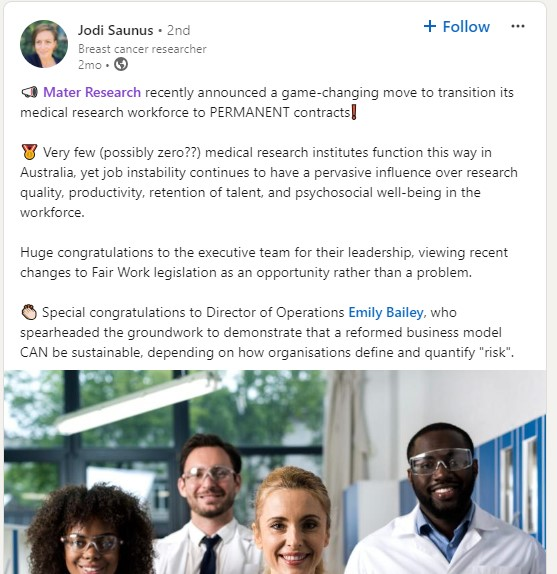
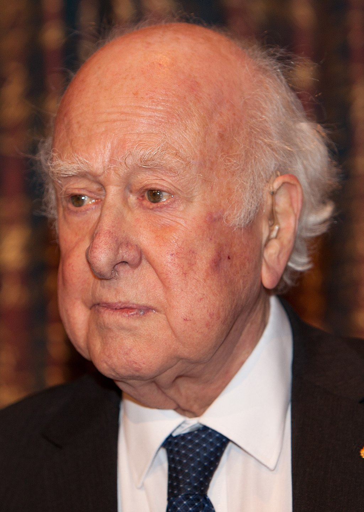
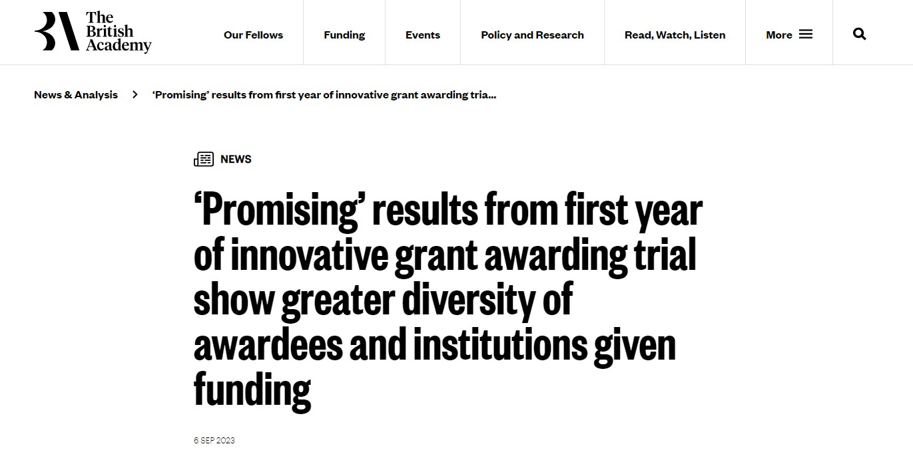
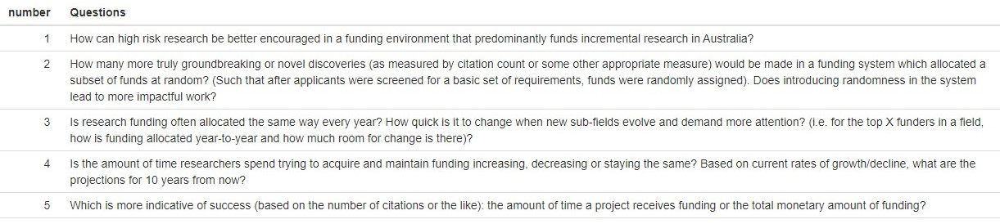

```{r setup, include=FALSE}
# see https://github.com/rstudio-education/arm-workshop-rsc2019/blob/master/static/slides/xaringan.Rmd
knitr::opts_chunk$set(echo = FALSE, warning=FALSE, message=FALSE, error=FALSE, comment='', dpi=400, fig.align='center')
options(htmltools.dir.version = FALSE)
#xaringanExtra::use_xaringan_extra(c("tile_view", "animate_css", "tachyons"))
library(tidyverse)
library(dplyr)
library(ggplot2)
library(knitr)
library(fontawesome) # from github: https://github.com/rstudio/fontawesome
cbbPalette <- c("#000000", "#E69F00", "#56B4E9", "#009E73", "#F0E442", "#0072B2", "#D55E00", "#CC79A7")
```

layout: true
  
---
name: xaringan-title
class: inverse, left, middle

.pull-left[

# .center[Alternative funding systems and research prioritisation]

## .center[Adrian Barnett, QUT]

### .center[30 April 2024]

[`r fa(name = "twitter")` @aidybarnett](http://twitter.com/aidybarnett)  

[`r fa(name = "github")` @agbarnett](http://github.com/agbarnett)  

[`r fa(name = "blog")` Median Watch](https://medianwatch.netlify.app)

[`r fa(name = "paper-plane")` a.barnett@qut.edu.au](mailto:a.barnett@qut.edu.au)

]

.pull-right[


(from @giphy)

]

---
class: center, middle
# What's your favourite shade of blue?

```{r, out.width='60%'}
# from Make_blues.R
knitr::include_graphics(path='figures/blues.jpg')
```

---
class: center, inverse
# Standard peer review


(from giphy)

---
# Noise in peer review #1

```{r, out.width='50%'}
# from gallo.R
knitr::include_graphics(path='figures/gallo.jpg')
```

###### [Gallo et al](https://journals.plos.org/plosone/article?id=10.1371/journal.pone.0165147) _PLOS ONE_ 2016


---
# Noise in peer review #2

```{r, out.width='60%'}
# from gallo.R
knitr::include_graphics(path='figures/nhmrc.jpg')
```

###### [NHMRC Report Peer Review Analysis Committee](https://www.nhmrc.gov.au/about-us/leadership-and-governance/committees/peer-review-analysis-committee)

---
class: inverse, center
# Equal allocation

```{r, echo=FALSE, out.width="90%"}
# had to increase size
knitr::include_graphics("https://media.giphy.com/media/gbErpwcLlizvi/giphy.gif")
```

---
class: center
# Peer-to-peer distribution

```{r, out.width='68%'}
knitr::include_graphics(path='figures/bollen.png')
```

---
class: inverse, center
# Use a formula

```{r, echo=FALSE, out.width="80%"}
# had to increase size
knitr::include_graphics("https://media.giphy.com/media/NbXTwsoD7hvag/giphy.gif")
```
(from giphy)


---
class: inverse, center
# Strong manager method


(from giphy)


Used by US Defense Advanced Research Projects Agency and NASA


---
class: center
# Fund people not projects


(from giphy)

<!--- Judge applications solely on the person --->

MacArthur Fellows programme in the USA

---
class: center
# Longer-term contracts

```{r, echo=FALSE, out.width="40%"}
# had to increase size

```

---
class: inverse
# Longer-term contracts

.pull-left[

## Peter Higgs: "I wouldn't be productive enough for today's academic system"

]

```{r, echo=FALSE, out.width="30%"}
# had to increase size

```

(Bengt Nyman, CC BY 2.0 <https://creativecommons.org/licenses/by/2.0>, via Wikimedia Commons)

---
class: center
# Two-stage application process


(from giphy)

Recently used by ARC for Discovery projects.

---
class: center
# Random allocation


(from giphy)

Used by New Zealand Health Research Council, The Wellcome Trust, and The British Academy

---
class: center
# Random allocation

```{r, out.width='78%'}
knitr::include_graphics(path='figures/lottery_paper.png')
```

63% in favour of using lottery, 25% against

---
# Did the lottery increase diversity?



---
class: inverse
## More "research on research"


### "We believe that much more research needs to be done on the nature of research and its application so that data from objective studies can be applied to all aspects of biomedical research. Because the very nature of research on research, particularly if it is prospective, requires long periods of time, we recommend that independent, highly competent groups be established with ample, long term support to conduct and support retrospective and prospective research on the nature of scientific discovery, to analyse the causes of long and short lags between discovery and clinical application and to suggest and test means of decreasing long lags, and to evaluate present and proposed mechanisms for the support of biomedical research and development.'' 

Comroe and Dripps. *Science* "Scientific basis for the support of biomedical science" 1976.

---
# [James Lind Alliance](https://www.jla.nihr.ac.uk/top-10-priorities/)

```{r, out.width='64%'}
knitr::include_graphics(path='figures/james_lind.png')
```

---
# Research prioritisation in research funding

### What questions about research funding would you like to see answered by research?


